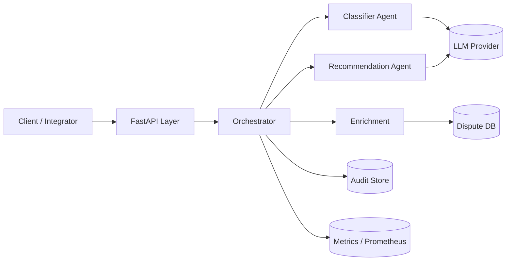
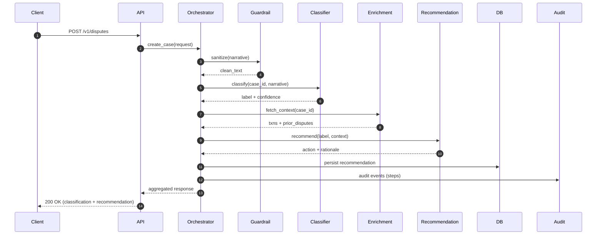
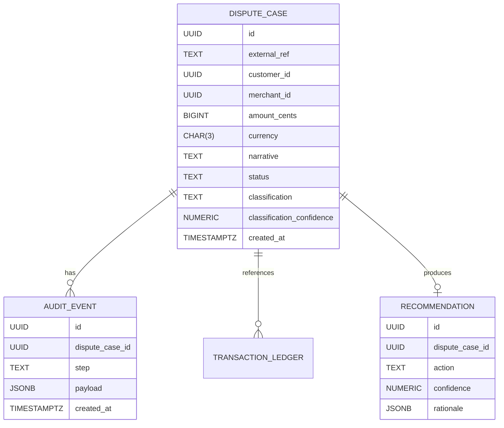
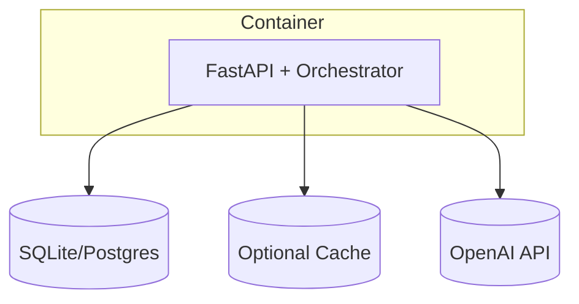

# Architecture Overview

This document provides deeper architectural detail beyond the high-level project README.

## 1. Context Diagram

## 2. Logical Component Layers
| Layer | Components | Responsibility |
|-------|-----------|----------------|
Interface | FastAPI routers, request validation | Input boundary, auth, rate limit |
Orchestration | Orchestrator controller, step planner | Order & manage agent execution |
Agents | Classifier, Enrichment, Recommendation, Guardrail | Business/ML logic units |
Data | Repositories (cases, transactions, audit) | Persistence abstraction |
Integration | LLM client, external service adapters | External API communication |
Observability | Metrics + Structured Logging + Tracing | Telemetry for reliability |
Security | Auth middleware, sanitizer, secrets mgmt | Protection & compliance |

## 3. Sequence (Dispute Submission)

## 4. Data Model (Simplified ER)

## 5. Deployment Topology (MVP)

## 6. Cross-Cutting Concerns
| Concern | Strategy |
|---------|----------|
Error Handling | Unified exception -> JSON error model |
Retries | Exponential backoff wrapper around LLM & DB transient errors |
Configuration | 12-factor: env vars with typed loader |
Security | API key (MVP), later OAuth2; prompt sanitization |
Versioning | Prefix /v1; embed `agent_version` in audit |
Resilience | Circuit breaker for LLM latency > threshold |

## 7. Scaling Considerations
| Bottleneck | Mitigation Path | Phase |
|------------|-----------------|-------|
LLM Latency | Async batch / parallelization | P2 |
DB Reads | Connection pooling, read replicas | P3 |
Throughput | Split agents into workers + queue | P3 |
Cost | Model tier routing + caching | P2 |

## 8. Security Notes
Narrative redaction (regex patterns) before LLM. Minimal PII fields in DB; hashed customer identifiers optional. Secrets via environment only.

## 9. Observability Mapping
Instrumentation via decorator attaches span (agent_name) + metrics counters. Structured logs JSON: {ts, level, case_id, step, latency_ms, success}.

## 10. Open Architecture Questions
| ID | Question | Resolution Path |
|----|----------|----------------|
ARCH-01 | Adopt Redis in MVP or defer? | Evaluate benefit vs complexity |
ARCH-02 | Use pgvector early? | Start with plain JSON; add later |

---
Version: 1.0.0 | Owner: Architecture | Status: Draft

