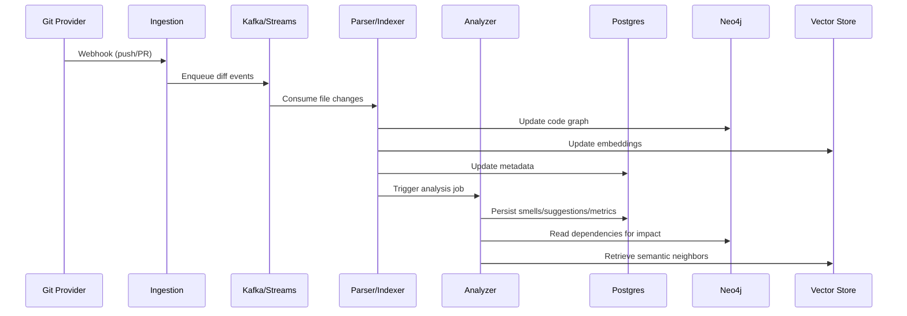
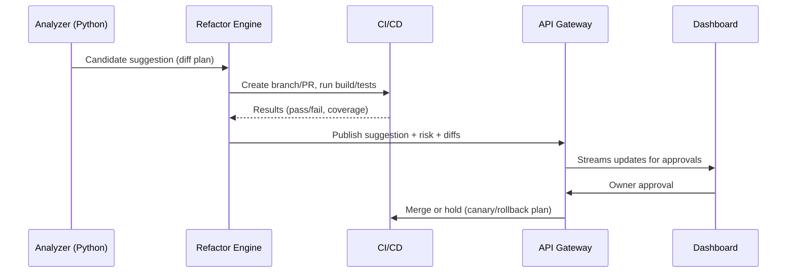

# Codebase Intelligence & Refactoring Engine

An end-to-end platform to analyze, monitor, and safely refactor large legacy codebases (1M–10M+ LOC). It identifies technical debt, detects code smells and architectural violations, suggests improvements, and automates refactoring with safety, rollback, and CI/CD integration.

---

## 0) Business Problem
- Large codebases with inconsistent patterns and legacy design slow velocity and increase risk.
- Teams cannot reliably detect systemic issues across millions of LOC; manual reviews don’t scale.
- Fear of regressions blocks needed refactors; technical debt trend is not visible.

Success Metrics
- ≥80% reduction in time to detect code smells/violations.
- ≥90% reduction in refactor-related defects (via safe automation + approvals).
- Accurate technical debt quantification with trend dashboards.
- Increased developer confidence and adoption of suggestions.

---

## 1) Requirements

Functional
- Multi-language analysis (MVP: Java, Python, JavaScript/TypeScript; extendable to Go, C#).
- Incremental parsing of ASTs/IRs; extract metrics, dependencies, call graphs.
- Intelligent pattern detection: code smells (god classes, duplication, long methods, cycles), architectural violations, inconsistent patterns.
- Technical debt metrics over time (complexity, duplication, coupling, coverage and docs gaps).
- Safe refactoring automation with impact analysis, tests verification, rollback/canary, CI/CD integration.
- DX: IDE plugins (VS Code/IntelliJ), web dashboard, CLI, reports.

Non-Functional
- Scalability: 10M+ LOC, concurrent repository analysis.
- Performance: 100k LOC < 5 min; incremental and parallel analysis.
- Security: TLS in transit; encryption at rest; opt-in retention of source artifacts.
- Reliability: 99.9% core analysis uptime.
- Extensibility: plugin architecture for languages, rules, patterns.

Architecture Constraints
- Cloud-native on AWS/GCP with Kubernetes.
- Polyglot: Go (core analysis), Python (AI/ML), React+TS (web UI).
- Event-driven pipelines.
- ML-powered embeddings, pattern recognition, suggestions.
- Incremental and modular analysis on changed files only.

---

## 2) High-level Architecture

```mermaid
flowchart LR
		subgraph SCM[SCM Providers]
			GH[GitHub]
			GL[GitLab]
		end

		GH --> IG[Ingestion Service (Go)]
		GL --> IG

		IG --> MQ[(Kafka/Redis Streams)]

		subgraph Workers
			PA[Parsers/Indexers (Go)]
			AN[Analyzers (Python)]
			RF[Refactor Engine (Go/Python)]
		end

		MQ --> PA --> GDB[(Neo4j Graph)]
		PA --> IDX[(Embeddings/Vector Store)]
		PA --> PG[(PostgreSQL)]

		AN --> PG
		AN --> GDB
		AN --> IDX

		RF --> PG
		RF --> OBJ[(Blob/Object Store)]
		RF --> CI[CI/CD]

		subgraph Access
			API[API Gateway (Go/Python)]
			UI[Web Dashboard (React+TS)]
			IDE[IDE Extensions]
			CLI[CLI]
		end

		API --> PG
		API --> GDB
		API --> IDX
		UI --> API
		IDE --> API
		CLI --> API

		subgraph Ops
			OBS[OpenTelemetry/Prometheus/Grafana]
			SEC[Vault/KMS]
		end

		API -.-> OBS
		PA -.-> OBS
		AN -.-> OBS
		RF -.-> OBS
		IG -.-> OBS
```

Key Services & Responsibilities
- Ingestion (Go): webhooks, polling, repo auth, branch filters, enqueue diffs.
- Parsers/Indexers (Go): ASTs/IRs, symbols, call/dependency graphs, embeddings.
- Analyzers (Python): rules + ML models for smells, architectural violations, recommendations.
- Refactor Engine (Go/Python): semantic codemods, impact analysis, run tests, create PRs.
- Storage: Postgres (metadata, metrics), Neo4j (code graph), Vector store (embeddings), Object store (artifacts), Redis (cache/queues if not Kafka).
- API Gateway: REST/GraphQL, auth, rate-limit; feeds UI/IDE/CLI.
- Observability: traces, metrics, logs, audit.

---

## 3) Component Interaction Specs

Orchestrated Analysis (Incremental)


Safe Refactoring & PR Flow


---

## 4) Database and Graph Schema Design

PostgreSQL (core tables)
- repos(id PK, provider, url, default_branch, visibility, created_at)
- commits(id PK, repo_id FK, sha, author, timestamp)
- files(id PK, repo_id FK, path, language, hash, size, last_commit_id FK)
- symbols(id PK, repo_id FK, file_id FK, name, kind, start_line, end_line, metadata jsonb)
- smells(id PK, repo_id FK, type, severity, file_id FK, symbol_id FK, location jsonb, evidence jsonb, created_at)
- suggestions(id PK, repo_id FK, smell_id FK, title, summary, diff_ref, risk_score, status, created_at)
- runs(id PK, repo_id FK, trigger, ruleset, started_at, finished_at, metrics jsonb)
- tests(id PK, repo_id FK, path, last_status, coverage_pct, last_run_at)
- approvals(id PK, suggestion_id FK, approver, decision, comment, timestamp)

Indexes
- files(repo_id, path), smells(repo_id, type), suggestions(repo_id, status)
- GIN indexes on jsonb fields (evidence, location, metrics)

Neo4j (graph model)
- Nodes: Repo, File, Symbol, Package/Module, Test
- Relationships:
	- (File)-[:IMPORTS]->(File)
	- (Symbol)-[:CALLS]->(Symbol)
	- (Symbol)-[:DEFINED_IN]->(File)
	- (File)-[:CONTAINS]->(Symbol)
	- (Test)-[:COVERS]->(Symbol|File)
- Use relationship properties for weights (call frequency, churn, ownership).

Vector Store
- Keys: (repo_id, file_id|symbol_id)
- Embeddings: dense vectors for code and doc blocks; metadata for language, path.

---

## 5) API Contracts (REST)

Auth: OAuth2/JWT; optional PAT for headless CLI.
Headers: x-org, x-repo, Idempotency-Key for mutating endpoints.

- POST /v1/repos
	- req: { url, provider, branches?: string[] }
	- rsp: { repoId }

- POST /v1/analyze
	- req: { repoId, depth?: "incremental"|"full", ruleset?: string }
	- rsp: { runId, status: "queued" }

- GET /v1/repos/{id}/smells?type=&severity=&file=&symbol=
	- rsp: { items: Smell[], nextPageToken? }

- POST /v1/suggestions
	- req: { repoId, smellId }
	- rsp: { suggestionId }

- POST /v1/refactors
	- req: { suggestionId, mode: "dry-run"|"pr", policyOverride?: object }
	- rsp: { prUrl?, status }

- GET /v1/runs/{id}
	- rsp: { id, repoId, trigger, started_at, finished_at, metrics }

Streaming
- SSE/WS /v1/streams/runs/{id} – progress updates
- SSE/WS /v1/streams/suggestions/{id} – approvals/tests status

Types (abridged)
- Smell: { id, type, severity, file, symbol?, evidence, created_at }
- Suggestion: { id, smellId, title, summary, risk_score, status, diff_ref }

Rate limiting
- Per-org and per-repo quotas; burst tokens for CI; backoff headers on 429.

---

## 6) AI/ML Integration Design

Models & Features
- Embeddings: code and doc chunks (e.g., CodeBERT, Instructor, or vendor API) for similarity and pattern search.
- Pattern detectors: ML classifiers/anomaly models for smells beyond rule-based.
- Ranking: learning-to-rank for prioritizing suggestions by impact and safety.

Pipelines
- Batch: nightly full scans; store features and results.
- Real-time: incremental on diffs; small models/caches for fast inference.

Feedback Loop
- Capture developer actions (accept/modify/reject) to retrain ranking and detectors.

MLOps
- Model registry, versioning, canary deploys; telemetry for model drift.

---

## 7) Deployment & Scaling Strategy

Kubernetes
- Separate node pools for CPU-bound parsers (Go) and GPU/CPU analyzers (Python).
- HPA on queue depth and CPU; autoscale 0→N for bursty workloads.

CI/CD
- GitHub Actions (or Cloud Build): build, test, scan, push images; deploy via ArgoCD.

Data
- Postgres with partitioning on repo_id; read replicas for analytics.
- Neo4j clustered; memory tuning for graph traversals.
- Redis/Kafka for queues and caching hot ASTs/summaries.
- Object store (S3/GCS) for diffs, artifacts, large reports.

Incremental Processing
- File-level hashing; AST cache; dependency-aware invalidation; only re-analyze impacted files.

---

## 8) Security, Compliance, Access Control
- TLS everywhere; AES-256 at rest.
- RBAC: org/repo/project roles; path/file ownership checks for suggestions.
- Secrets: Vault/KMS; short-lived tokens for SCM and CI.
- Audit logs: all accesses, suggestions, approvals, merges.
- Compliance: configurable data retention; PII scrubbing; SOC2/GDPR alignment.

---

## 9) Performance Benchmarks & Load Testing
- Targets: 100k LOC < 5 min parse+index; P95 API < 1s for smells listing; 10M LOC full scan overnight.
- Tools: Locust/k6 for API; custom repo synthesizer for LOC scaling; Neo4j cypher profiling; pgbench for Postgres.
- Scenarios: concurrent analyses across 50 repos; burst of 1k file changes; long dependency chains.

---

## 10) Monitoring, Logging, Observability
- OpenTelemetry traces across ingestion → parse → analyze → suggest → PR.
- Prometheus metrics: queue depth, job durations, smells/suggestions per run, PR pass rates.
- Grafana dashboards; SLOs (availability 99.9%, P95 latencies), alerting on error budgets.
- Centralized logs with correlation IDs; error tracking (Sentry).

---

## 11) Developer Experience & UX
- IDE Plugins (VS Code/IntelliJ): inline diagnostics, quick-fix previews, apply patch, PR creation.
- Web Dashboard (React+TS + Monaco): repo health, debt trends, hotspots, suggestions queue, diff viewer, approvals.
- CLI: repo register, analyze, fetch smells, generate suggestions, open PR; CI-friendly.
- Onboarding: sample rulesets, org policy templates, quickstarts.

---

## 12) Trade-offs & Alternatives
- Graph (Neo4j) vs SQL joins: graph improves cross-repo traversal and impact analysis at scale.
- Vendor embeddings vs OSS: vendor APIs may yield better semantics; OSS improves control/compliance.
- Aggressive automation vs safety: prefer developer-in-the-loop and canary/cap checks.

---

## 13) Roadmap
- MVP: Java+Python parsers; incremental analysis; smells + suggestions; dashboard; PR bot; CI integration.
- Phase 2: Go/TS/C# support; semantic patcher expansions; advanced ranking; organization knowledge base.
- Phase 3: Cross-repo architecture governance; automated fleet-wide refactors with auto-rollback.

---

Acceptance Criteria
- End-to-end from ingest → analysis → suggestions → PR with tests and approvals.
- Safety gates (policies, ownership, rollback) and auditability.
- Observability (traces/metrics/logs) and documented runbooks.
