# AI Analysis Engine Component Architecture

## Component Overview
The AI Analysis Engine is the core intelligence component that applies machine learning and rule-based analysis to detect code patterns, assess quality, and identify refactoring opportunities.

```mermaid
graph TB
    subgraph "Input Sources"
        AST_DATA[🌳 AST Data<br/>Parsed Code Trees]
        GRAPH_DATA[🕸️ Graph Data<br/>Code Relationships]
        METRICS_DATA[📊 Metrics Data<br/>Quality Indicators]
        HISTORICAL_DATA[📈 Historical Data<br/>Change Patterns]
    end

    subgraph "Feature Engineering"
        subgraph "Static Features"
            STRUCTURAL[🏗️ Structural Features<br/>AST Patterns]
            TEXTUAL[📝 Textual Features<br/>Identifier Names]
            METRIC_FEATURES[📏 Metric Features<br/>Complexity & Size]
            DEPENDENCY_FEATURES[🔗 Dependency Features<br/>Coupling & Cohesion]
        end

        subgraph "Dynamic Features"
            CHANGE_PATTERNS[🔄 Change Patterns<br/>Git History Analysis]
            HOTSPOT_FEATURES[🔥 Hotspot Features<br/>Frequency Analysis]
            TEAM_FEATURES[👥 Team Features<br/>Ownership Patterns]
            TEMPORAL_FEATURES[⏰ Temporal Features<br/>Time-based Trends]
        end

        FEATURE_COMBINER[🧩 Feature Combiner<br/>Multi-modal Fusion]
    end

    subgraph "ML Model Pipeline"
        subgraph "Embedding Models"
            CODE_ENCODER[🔤 Code Encoder<br/>CodeBERT/GraphCodeBERT]
            GRAPH_ENCODER[🕸️ Graph Encoder<br/>Graph Neural Networks]
            SEQUENCE_ENCODER[📝 Sequence Encoder<br/>Transformer Models]
        end

        subgraph "Classification Models"
            SMELL_CLASSIFIER[👃 Code Smell Classifier<br/>Multi-class Detection]
            RISK_CLASSIFIER[⚠️ Risk Classifier<br/>Defect Prediction]
            QUALITY_CLASSIFIER[⭐ Quality Classifier<br/>Maintainability Assessment]
            SECURITY_CLASSIFIER[🔒 Security Classifier<br/>Vulnerability Detection]
        end

        subgraph "Similarity Models"
            CLONE_DETECTOR[👯 Clone Detector<br/>Semantic Similarity]
            PATTERN_MATCHER[🎯 Pattern Matcher<br/>Anti-pattern Recognition]
            DUPLICATE_FINDER[🔍 Duplicate Finder<br/>Near-duplicate Detection]
        end

        MODEL_ENSEMBLE[🎭 Model Ensemble<br/>Prediction Aggregation]
    end

    subgraph "Rule Engine"
        subgraph "Static Rules"
            COMPLEXITY_RULES[📊 Complexity Rules<br/>Thresholds & Limits]
            SIZE_RULES[📏 Size Rules<br/>Method & Class Limits]
            NAMING_RULES[🏷️ Naming Rules<br/>Convention Validation]
            STRUCTURE_RULES[🏗️ Structure Rules<br/>Architecture Patterns]
        end

        subgraph "Dynamic Rules"
            PERFORMANCE_RULES[⚡ Performance Rules<br/>Efficiency Patterns]
            SECURITY_RULES[🔐 Security Rules<br/>Vulnerability Patterns]
            MAINTAINABILITY_RULES[🔧 Maintainability Rules<br/>Technical Debt]
            TESTING_RULES[🧪 Testing Rules<br/>Coverage & Quality]
        end

        RULE_EXECUTOR[⚙️ Rule Executor<br/>Pattern Matching Engine]
    end

    subgraph "Analysis Orchestrator"
        ANALYSIS_SCHEDULER[📅 Analysis Scheduler<br/>Priority Queue Management]
        PARALLEL_EXECUTOR[⚡ Parallel Executor<br/>Concurrent Processing]
        RESULT_AGGREGATOR[📊 Result Aggregator<br/>Finding Consolidation]
        CONFIDENCE_SCORER[🎯 Confidence Scorer<br/>Reliability Assessment]
    end

    subgraph "Output Processing"
        FINDING_GENERATOR[📋 Finding Generator<br/>Issue Description]
        EVIDENCE_COLLECTOR[📸 Evidence Collector<br/>Supporting Information]
        RECOMMENDATION_ENGINE[💡 Recommendation Engine<br/>Action Suggestions]
        IMPACT_ASSESSOR[📈 Impact Assessor<br/>Priority & Effort Estimation]
    end

    subgraph "Model Management"
        MODEL_REGISTRY[📚 Model Registry<br/>Version Control]
        MODEL_MONITOR[👁️ Model Monitor<br/>Performance Tracking]
        FEATURE_STORE[🏪 Feature Store<br/>Feature Management]
        EXPERIMENT_TRACKER[🧪 Experiment Tracker<br/>A/B Testing]
    end

    subgraph "Data Storage"
        VECTOR_DB[(🔢 Vector Database<br/>Embeddings Storage)]
        FEATURE_CACHE[(⚡ Feature Cache<br/>Redis Cluster)]
        MODEL_STORE[(🎯 Model Store<br/>Trained Models)]
        RESULTS_DB[(📊 Results Database<br/>Analysis Outputs)]
    end

    %% Input flow
    AST_DATA --> STRUCTURAL
    AST_DATA --> TEXTUAL
    GRAPH_DATA --> DEPENDENCY_FEATURES
    METRICS_DATA --> METRIC_FEATURES
    HISTORICAL_DATA --> CHANGE_PATTERNS
    HISTORICAL_DATA --> HOTSPOT_FEATURES
    HISTORICAL_DATA --> TEAM_FEATURES
    HISTORICAL_DATA --> TEMPORAL_FEATURES

    %% Feature engineering
    STRUCTURAL --> FEATURE_COMBINER
    TEXTUAL --> FEATURE_COMBINER
    METRIC_FEATURES --> FEATURE_COMBINER
    DEPENDENCY_FEATURES --> FEATURE_COMBINER
    CHANGE_PATTERNS --> FEATURE_COMBINER
    HOTSPOT_FEATURES --> FEATURE_COMBINER
    TEAM_FEATURES --> FEATURE_COMBINER
    TEMPORAL_FEATURES --> FEATURE_COMBINER

    %% ML pipeline
    FEATURE_COMBINER --> CODE_ENCODER
    FEATURE_COMBINER --> GRAPH_ENCODER
    FEATURE_COMBINER --> SEQUENCE_ENCODER

    CODE_ENCODER --> SMELL_CLASSIFIER
    CODE_ENCODER --> CLONE_DETECTOR
    GRAPH_ENCODER --> RISK_CLASSIFIER
    SEQUENCE_ENCODER --> SECURITY_CLASSIFIER

    SMELL_CLASSIFIER --> MODEL_ENSEMBLE
    RISK_CLASSIFIER --> MODEL_ENSEMBLE
    QUALITY_CLASSIFIER --> MODEL_ENSEMBLE
    SECURITY_CLASSIFIER --> MODEL_ENSEMBLE
    CLONE_DETECTOR --> MODEL_ENSEMBLE
    PATTERN_MATCHER --> MODEL_ENSEMBLE
    DUPLICATE_FINDER --> MODEL_ENSEMBLE

    %% Rule engine flow
    FEATURE_COMBINER --> RULE_EXECUTOR
    COMPLEXITY_RULES --> RULE_EXECUTOR
    SIZE_RULES --> RULE_EXECUTOR
    NAMING_RULES --> RULE_EXECUTOR
    STRUCTURE_RULES --> RULE_EXECUTOR
    PERFORMANCE_RULES --> RULE_EXECUTOR
    SECURITY_RULES --> RULE_EXECUTOR
    MAINTAINABILITY_RULES --> RULE_EXECUTOR
    TESTING_RULES --> RULE_EXECUTOR

    %% Orchestration
    MODEL_ENSEMBLE --> ANALYSIS_SCHEDULER
    RULE_EXECUTOR --> ANALYSIS_SCHEDULER
    ANALYSIS_SCHEDULER --> PARALLEL_EXECUTOR
    PARALLEL_EXECUTOR --> RESULT_AGGREGATOR
    RESULT_AGGREGATOR --> CONFIDENCE_SCORER

    %% Output processing
    CONFIDENCE_SCORER --> FINDING_GENERATOR
    FINDING_GENERATOR --> EVIDENCE_COLLECTOR
    EVIDENCE_COLLECTOR --> RECOMMENDATION_ENGINE
    RECOMMENDATION_ENGINE --> IMPACT_ASSESSOR

    %% Model management
    MODEL_ENSEMBLE --> MODEL_MONITOR
    MODEL_REGISTRY --> CODE_ENCODER
    MODEL_REGISTRY --> GRAPH_ENCODER
    MODEL_REGISTRY --> SEQUENCE_ENCODER
    FEATURE_STORE --> FEATURE_COMBINER
    EXPERIMENT_TRACKER --> MODEL_MONITOR

    %% Storage connections
    CODE_ENCODER --> VECTOR_DB
    FEATURE_COMBINER --> FEATURE_CACHE
    MODEL_REGISTRY --> MODEL_STORE
    IMPACT_ASSESSOR --> RESULTS_DB

    %% Styling
    classDef input fill:#e3f2fd,stroke:#1976d2,stroke-width:2px
    classDef feature fill:#e8f5e8,stroke:#388e3c,stroke-width:2px
    classDef ml fill:#fff3e0,stroke:#f57c00,stroke-width:2px
    classDef rules fill:#f3e5f5,stroke:#7b1fa2,stroke-width:2px
    classDef orchestration fill:#e0f2f1,stroke:#00796b,stroke-width:2px
    classDef output fill:#fce4ec,stroke:#c2185b,stroke-width:2px
    classDef management fill:#e1f5fe,stroke:#0277bd,stroke-width:2px
    classDef storage fill:#f9fbe7,stroke:#689f38,stroke-width:2px

    class AST_DATA,GRAPH_DATA,METRICS_DATA,HISTORICAL_DATA input
    class STRUCTURAL,TEXTUAL,METRIC_FEATURES,DEPENDENCY_FEATURES,CHANGE_PATTERNS,HOTSPOT_FEATURES,TEAM_FEATURES,TEMPORAL_FEATURES,FEATURE_COMBINER feature
    class CODE_ENCODER,GRAPH_ENCODER,SEQUENCE_ENCODER,SMELL_CLASSIFIER,RISK_CLASSIFIER,QUALITY_CLASSIFIER,SECURITY_CLASSIFIER,CLONE_DETECTOR,PATTERN_MATCHER,DUPLICATE_FINDER,MODEL_ENSEMBLE ml
    class COMPLEXITY_RULES,SIZE_RULES,NAMING_RULES,STRUCTURE_RULES,PERFORMANCE_RULES,SECURITY_RULES,MAINTAINABILITY_RULES,TESTING_RULES,RULE_EXECUTOR rules
    class ANALYSIS_SCHEDULER,PARALLEL_EXECUTOR,RESULT_AGGREGATOR,CONFIDENCE_SCORER orchestration
    class FINDING_GENERATOR,EVIDENCE_COLLECTOR,RECOMMENDATION_ENGINE,IMPACT_ASSESSOR output
    class MODEL_REGISTRY,MODEL_MONITOR,FEATURE_STORE,EXPERIMENT_TRACKER management
    class VECTOR_DB,FEATURE_CACHE,MODEL_STORE,RESULTS_DB storage
```



## Core Analysis Capabilities

### **Code Smell Detection**
| Smell Type | Detection Method | Confidence Score |
|------------|------------------|------------------|
| Long Method | AST depth + metrics | 0.95 |
| Large Class | LOC + method count | 0.90 |
| Data Clumps | Parameter analysis | 0.85 |
| Feature Envy | Coupling metrics | 0.80 |
| God Object | Complexity + responsibility | 0.88 |
| Shotgun Surgery | Change impact analysis | 0.75 |

### **Security Vulnerability Detection**
```yaml
security_patterns:
  injection_attacks:
    - sql_injection: "SQL query construction patterns"
    - command_injection: "Shell command execution"
    - xss_vulnerabilities: "HTML output without sanitization"
    
  authentication_issues:
    - weak_passwords: "Password complexity validation"
    - session_management: "Session token handling"
    - authorization_bypass: "Access control patterns"
    
  data_exposure:
    - hardcoded_secrets: "API keys and passwords in code"
    - information_leakage: "Debug information exposure"
    - insecure_storage: "Unencrypted sensitive data"
```

### **Clone Detection Algorithms**
```python
# Semantic clone detection pipeline
class CloneDetector:
    def __init__(self):
        self.embedder = CodeBERTEmbedder()
        self.similarity_threshold = 0.85
        
    def detect_clones(self, code_fragments):
        # Generate embeddings
        embeddings = self.embedder.encode(code_fragments)
        
        # Compute pairwise similarities
        similarities = cosine_similarity(embeddings)
        
        # Identify clone pairs
        clone_pairs = self.find_similar_pairs(similarities)
        
        return self.group_clones(clone_pairs)
```

## Machine Learning Models

### **Model Architecture**
```yaml
models:
  code_encoder:
    type: "transformer"
    base_model: "microsoft/codebert-base"
    fine_tuning:
      tasks: ["code_similarity", "defect_prediction"]
      datasets: ["codexglue", "internal_repos"]
      
  graph_encoder:
    type: "graph_neural_network"
    architecture: "GraphSAGE"
    layers: 3
    embedding_dim: 256
    
  risk_classifier:
    type: "ensemble"
    models: ["random_forest", "gradient_boosting", "neural_network"]
    features: ["structural", "historical", "team"]
    
  clone_detector:
    type: "siamese_network"
    similarity_metric: "cosine"
    threshold: 0.85
```

### **Training Pipeline**
```yaml
training_config:
  data_sources:
    - github_repos: "Public repositories with known issues"
    - internal_history: "Historical defect data"
    - code_reviews: "Review comments and outcomes"
    
  validation_strategy:
    type: "time_series_split"
    train_ratio: 0.7
    validation_ratio: 0.15
    test_ratio: 0.15
    
  hyperparameter_tuning:
    method: "bayesian_optimization"
    trials: 100
    metrics: ["f1_score", "precision", "recall"]
    
  model_versioning:
    registry: "mlflow"
    promotion_criteria:
      - f1_score: "> 0.85"
      - precision: "> 0.80"
      - recall: "> 0.75"
```

## Rule Engine Configuration

### **Configurable Rules**
```yaml
rule_categories:
  complexity:
    cyclomatic_complexity:
      threshold: 10
      severity: "medium"
      message: "Method has high cyclomatic complexity"
      
    cognitive_complexity:
      threshold: 15
      severity: "high"
      message: "Method is difficult to understand"
      
  size:
    method_length:
      threshold: 50
      severity: "medium"
      message: "Method is too long"
      
    class_size:
      threshold: 500
      severity: "high"
      message: "Class has too many lines"
      
  naming:
    variable_naming:
      pattern: "^[a-z][a-zA-Z0-9]*$"
      severity: "low"
      message: "Variable name doesn't follow camelCase convention"
      
    constant_naming:
      pattern: "^[A-Z][A-Z0-9_]*$"
      severity: "low"
      message: "Constant should be in UPPER_CASE"
```

### **Custom Rule Development**
```javascript
// Example custom rule for detecting inefficient loops
class InefficientLoopRule {
  constructor() {
    this.id = 'inefficient_loop';
    this.severity = 'medium';
    this.category = 'performance';
  }
  
  analyze(astNode) {
    if (this.isNestedLoop(astNode)) {
      const complexity = this.calculateComplexity(astNode);
      if (complexity > this.threshold) {
        return {
          message: 'Nested loop may cause performance issues',
          evidence: this.extractEvidence(astNode),
          suggestion: 'Consider optimizing with better data structures'
        };
      }
    }
    return null;
  }
}
```

## Performance Optimization

### **Caching Strategy**
```yaml
caching_layers:
  feature_cache:
    storage: "Redis Cluster"
    ttl: "24 hours"
    key_pattern: "features:{repo_id}:{file_hash}"
    
  embedding_cache:
    storage: "Vector Database"
    ttl: "7 days"
    dimension: 768
    index_type: "HNSW"
    
  model_cache:
    storage: "Local SSD"
    models: ["frequently_used", "lightweight"]
    warm_up: true
    
  result_cache:
    storage: "PostgreSQL"
    ttl: "30 days"
    partitioning: "by_repository"
```

### **Parallel Processing**
```yaml
parallelization:
  file_level:
    max_workers: 16
    queue_size: 1000
    timeout: "5 minutes"
    
  model_inference:
    batch_size: 32
    gpu_acceleration: true
    model_sharding: true
    
  rule_execution:
    thread_pool: 8
    rule_batching: true
    early_termination: true
```

## Quality Assurance

### **Model Validation**
```yaml
validation_metrics:
  classification:
    - precision: "True positives / (True positives + False positives)"
    - recall: "True positives / (True positives + False negatives)"
    - f1_score: "2 * (precision * recall) / (precision + recall)"
    - accuracy: "Correct predictions / Total predictions"
    
  ranking:
    - ndcg: "Normalized Discounted Cumulative Gain"
    - map: "Mean Average Precision"
    - mrr: "Mean Reciprocal Rank"
    
  similarity:
    - cosine_similarity: "Dot product of normalized vectors"
    - jaccard_similarity: "Intersection over union"
    - edit_distance: "Minimum edit operations"
```

### **Monitoring & Alerting**
```yaml
monitoring:
  model_drift:
    metric: "prediction_distribution"
    threshold: "0.1 KL divergence"
    action: "retrain_model"
    
  performance_degradation:
    metric: "f1_score"
    threshold: "< 0.8"
    action: "alert_team"
    
  latency_monitoring:
    p99_latency: "< 5 seconds"
    average_latency: "< 2 seconds"
    timeout: "30 seconds"
```