# Developer Interfaces Component Architecture

## Component Overview
The Developer Interfaces component provides multiple touchpoints for developers to interact with the Codebase Intelligence Engine, including web dashboards, IDE extensions, CLI tools, and integration APIs.

```mermaid
graph TB
    subgraph "User Interfaces"
        subgraph "Web Application"
            WEB_DASHBOARD[🌐 Web Dashboard<br/>React/Vue.js SPA]
            REPOSITORY_BROWSER[📁 Repository Browser<br/>Code Navigation]
            ANALYTICS_DASHBOARD[📊 Analytics Dashboard<br/>Metrics & Trends]
            PLAN_MANAGER[📋 Plan Manager<br/>Refactoring Workflows]
        end

        subgraph "IDE Extensions"
            VSCODE_EXT[🆚 VS Code Extension<br/>TypeScript/Language Server]
            INTELLIJ_EXT[🧠 IntelliJ Plugin<br/>Java/Kotlin]
            JETBRAINS_EXT[⚡ JetBrains Suite<br/>Multi-language Support]
            VIM_EXT[📝 Vim/Neovim Plugin<br/>Lua/Vimscript]
        end

        subgraph "Command Line Tools"
            CLI_TOOL[⌨️ CLI Tool<br/>Node.js/Go Binary]
            SHELL_INTEGRATION[🐚 Shell Integration<br/>Bash/Zsh Completions]
            CI_CD_PLUGINS[🔄 CI/CD Plugins<br/>GitHub Actions/Jenkins]
        end

        subgraph "Mobile & Notifications"
            MOBILE_APP[📱 Mobile App<br/>React Native/Flutter]
            PUSH_NOTIFICATIONS[🔔 Push Notifications<br/>Firebase/APNs]
            EMAIL_NOTIFICATIONS[📧 Email Notifications<br/>Template Engine]
            SLACK_INTEGRATION[💬 Slack Integration<br/>Bot & Webhooks]
        end
    end

    subgraph "API Gateway Layer"
        PUBLIC_API[🌐 Public API<br/>REST/GraphQL]
        WEBSOCKET_API[🔌 WebSocket API<br/>Real-time Updates]
        WEBHOOK_MANAGER[🎣 Webhook Manager<br/>Event Delivery]
        API_DOCUMENTATION[📚 API Documentation<br/>OpenAPI/Swagger]
    end

    subgraph "Authentication & Authorization"
        AUTH_SERVICE[🔐 Authentication Service<br/>OAuth 2.0/OIDC]
        SESSION_MANAGER[🎫 Session Manager<br/>JWT Tokens]
        PERMISSION_MANAGER[🛡️ Permission Manager<br/>RBAC/ABAC]
        API_KEY_MANAGER[🗝️ API Key Manager<br/>Token Management]
    end

    subgraph "Real-time Communication"
        WEBSOCKET_SERVER[📡 WebSocket Server<br/>Socket.io/Native WS]
        NOTIFICATION_BROKER[📬 Notification Broker<br/>Redis Pub/Sub]
        EVENT_STREAM[🌊 Event Stream<br/>Server-Sent Events]
        PRESENCE_MANAGER[👁️ Presence Manager<br/>User Activity Tracking]
    end

    subgraph "Content Management"
        subgraph "Visualization Engine"
            GRAPH_RENDERER[🕸️ Graph Renderer<br/>D3.js/Cytoscape.js]
            CHART_GENERATOR[📊 Chart Generator<br/>Chart.js/Plotly]
            CODE_HIGHLIGHTER[🎨 Code Highlighter<br/>Prism.js/Monaco]
            DIFF_VISUALIZER[📝 Diff Visualizer<br/>Monaco Diff Editor]
        end

        subgraph "Data Processing"
            DATA_TRANSFORMER[🔄 Data Transformer<br/>Format Conversion]
            AGGREGATION_ENGINE[📈 Aggregation Engine<br/>Metrics Calculation]
            FILTERING_ENGINE[🔍 Filtering Engine<br/>Search & Filter]
            CACHING_LAYER[⚡ Caching Layer<br/>Client-side Cache]
        end

        TEMPLATE_ENGINE[📄 Template Engine<br/>Dynamic Content]
    end

    subgraph "Integration Adapters"
        subgraph "Git Provider Adapters"
            GITHUB_ADAPTER[🐙 GitHub Adapter<br/>PR Comments & Status]
            GITLAB_ADAPTER[🦊 GitLab Adapter<br/>MR Integration]
            AZURE_ADAPTER[🔷 Azure DevOps Adapter<br/>Work Items & PRs]
            BITBUCKET_ADAPTER[🪣 Bitbucket Adapter<br/>PR & Pipeline Integration]
        end

        subgraph "Communication Adapters"
            SLACK_ADAPTER[💬 Slack Adapter<br/>Bot Commands & Messages]
            TEAMS_ADAPTER[👥 Teams Adapter<br/>Cards & Notifications]
            DISCORD_ADAPTER[🎮 Discord Adapter<br/>Bot Integration]
            EMAIL_ADAPTER[📧 Email Adapter<br/>SMTP/SendGrid]
        end

        JIRA_ADAPTER[📋 Jira Adapter<br/>Issue Creation & Updates]
    end

    subgraph "Backend Services"
        CORE_API[🏗️ Core API Services<br/>Business Logic]
        ANALYSIS_SERVICE[🧠 Analysis Service<br/>Findings & Insights]
        PLANNING_SERVICE[📋 Planning Service<br/>Refactoring Plans]
        EXECUTION_SERVICE[⚙️ Execution Service<br/>Plan Implementation]
    end

    subgraph "Data Storage"
        USER_PREFERENCES[(👤 User Preferences<br/>PostgreSQL)]
        SESSION_STORE[(🎫 Session Store<br/>Redis)]
        NOTIFICATION_QUEUE[(📬 Notification Queue<br/>RabbitMQ)]
        ANALYTICS_DB[(📊 Analytics DB<br/>ClickHouse)]
    end

    %% User interface connections
    WEB_DASHBOARD --> PUBLIC_API
    WEB_DASHBOARD --> WEBSOCKET_API
    REPOSITORY_BROWSER --> PUBLIC_API
    ANALYTICS_DASHBOARD --> PUBLIC_API
    PLAN_MANAGER --> PUBLIC_API

    VSCODE_EXT --> PUBLIC_API
    VSCODE_EXT --> WEBSOCKET_API
    INTELLIJ_EXT --> PUBLIC_API
    JETBRAINS_EXT --> PUBLIC_API
    VIM_EXT --> PUBLIC_API

    CLI_TOOL --> PUBLIC_API
    CI_CD_PLUGINS --> PUBLIC_API
    MOBILE_APP --> PUBLIC_API
    MOBILE_APP --> WEBSOCKET_API

    %% API Gateway connections
    PUBLIC_API --> AUTH_SERVICE
    WEBSOCKET_API --> AUTH_SERVICE
    WEBHOOK_MANAGER --> AUTH_SERVICE

    %% Authentication flow
    AUTH_SERVICE --> SESSION_MANAGER
    SESSION_MANAGER --> PERMISSION_MANAGER
    PERMISSION_MANAGER --> API_KEY_MANAGER

    %% Real-time communication
    WEBSOCKET_API --> WEBSOCKET_SERVER
    WEBSOCKET_SERVER --> NOTIFICATION_BROKER
    NOTIFICATION_BROKER --> EVENT_STREAM
    EVENT_STREAM --> PRESENCE_MANAGER

    %% Content processing
    PUBLIC_API --> DATA_TRANSFORMER
    DATA_TRANSFORMER --> AGGREGATION_ENGINE
    AGGREGATION_ENGINE --> FILTERING_ENGINE
    FILTERING_ENGINE --> TEMPLATE_ENGINE

    WEB_DASHBOARD --> GRAPH_RENDERER
    WEB_DASHBOARD --> CHART_GENERATOR
    WEB_DASHBOARD --> CODE_HIGHLIGHTER
    PLAN_MANAGER --> DIFF_VISUALIZER

    %% Integration adapters
    WEBHOOK_MANAGER --> GITHUB_ADAPTER
    WEBHOOK_MANAGER --> GITLAB_ADAPTER
    WEBHOOK_MANAGER --> AZURE_ADAPTER
    WEBHOOK_MANAGER --> BITBUCKET_ADAPTER

    NOTIFICATION_BROKER --> SLACK_ADAPTER
    NOTIFICATION_BROKER --> TEAMS_ADAPTER
    NOTIFICATION_BROKER --> EMAIL_ADAPTER
    NOTIFICATION_BROKER --> PUSH_NOTIFICATIONS

    %% Backend service connections
    PUBLIC_API --> CORE_API
    CORE_API --> ANALYSIS_SERVICE
    CORE_API --> PLANNING_SERVICE
    CORE_API --> EXECUTION_SERVICE

    %% Storage connections
    SESSION_MANAGER --> SESSION_STORE
    PERMISSION_MANAGER --> USER_PREFERENCES
    NOTIFICATION_BROKER --> NOTIFICATION_QUEUE
    AGGREGATION_ENGINE --> ANALYTICS_DB
    FILTERING_ENGINE --> CACHING_LAYER

    %% Styling
    classDef ui fill:#e3f2fd,stroke:#1976d2,stroke-width:2px
    classDef api fill:#e8f5e8,stroke:#388e3c,stroke-width:2px
    classDef auth fill:#fff3e0,stroke:#f57c00,stroke-width:2px
    classDef realtime fill:#f3e5f5,stroke:#7b1fa2,stroke-width:2px
    classDef content fill:#e0f2f1,stroke:#00796b,stroke-width:2px
    classDef integration fill:#fce4ec,stroke:#c2185b,stroke-width:2px
    classDef backend fill:#e1f5fe,stroke:#0277bd,stroke-width:2px
    classDef storage fill:#f9fbe7,stroke:#689f38,stroke-width:2px

    class WEB_DASHBOARD,REPOSITORY_BROWSER,ANALYTICS_DASHBOARD,PLAN_MANAGER,VSCODE_EXT,INTELLIJ_EXT,JETBRAINS_EXT,VIM_EXT,CLI_TOOL,SHELL_INTEGRATION,CI_CD_PLUGINS,MOBILE_APP,PUSH_NOTIFICATIONS,EMAIL_NOTIFICATIONS,SLACK_INTEGRATION ui
    class PUBLIC_API,WEBSOCKET_API,WEBHOOK_MANAGER,API_DOCUMENTATION api
    class AUTH_SERVICE,SESSION_MANAGER,PERMISSION_MANAGER,API_KEY_MANAGER auth
    class WEBSOCKET_SERVER,NOTIFICATION_BROKER,EVENT_STREAM,PRESENCE_MANAGER realtime
    class GRAPH_RENDERER,CHART_GENERATOR,CODE_HIGHLIGHTER,DIFF_VISUALIZER,DATA_TRANSFORMER,AGGREGATION_ENGINE,FILTERING_ENGINE,CACHING_LAYER,TEMPLATE_ENGINE content
    class GITHUB_ADAPTER,GITLAB_ADAPTER,AZURE_ADAPTER,BITBUCKET_ADAPTER,SLACK_ADAPTER,TEAMS_ADAPTER,DISCORD_ADAPTER,EMAIL_ADAPTER,JIRA_ADAPTER integration
    class CORE_API,ANALYSIS_SERVICE,PLANNING_SERVICE,EXECUTION_SERVICE backend
    class USER_PREFERENCES,SESSION_STORE,NOTIFICATION_QUEUE,ANALYTICS_DB storage
```



## Web Dashboard Features

### **Repository Overview Dashboard**
```typescript
interface RepositoryDashboard {
  overview: {
    totalFiles: number;
    linesOfCode: number;
    languages: LanguageBreakdown[];
    lastScanTime: Date;
    healthScore: number;
  };
  
  recentFindings: Finding[];
  activeRefactoringPlans: RefactoringPlan[];
  codeMetrics: {
    complexity: ComplexityTrend[];
    techDebt: TechDebtTrend[];
    testCoverage: CoverageTrend[];
    duplicateCode: DuplicationTrend[];
  };
  
  teamActivity: {
    contributions: ContributorActivity[];
    hotspots: FileHotspot[];
    reviewMetrics: ReviewMetrics;
  };
}

// React component structure
const RepositoryDashboard: React.FC = () => {
  const [repository, setRepository] = useState<Repository>();
  const [metrics, setMetrics] = useState<RepositoryMetrics>();
  const [realTimeUpdates, setRealTimeUpdates] = useState<boolean>(true);
  
  // WebSocket connection for real-time updates
  useEffect(() => {
    const ws = new WebSocket(`wss://api.codebase-intelligence.com/ws/repo/${repoId}`);
    
    ws.onmessage = (event) => {
      const update = JSON.parse(event.data);
      handleRealTimeUpdate(update);
    };
    
    return () => ws.close();
  }, []);
  
  return (
    <div className="repository-dashboard">
      <OverviewCards metrics={metrics} />
      <FindingsTable findings={repository?.recentFindings} />
      <MetricsCharts trends={metrics?.trends} />
      <ActivityFeed activities={repository?.teamActivity} />
    </div>
  );
};
```

### **Interactive Code Graph Visualization**
```javascript
// D3.js-based graph visualization
class CodeGraphVisualization {
  constructor(containerId, options) {
    this.container = d3.select(containerId);
    this.width = options.width || 1200;
    this.height = options.height || 800;
    this.options = options;
    
    this.initializeVisualization();
  }
  
  initializeVisualization() {
    this.svg = this.container
      .append('svg')
      .attr('width', this.width)
      .attr('height', this.height);
    
    // Force simulation for node positioning
    this.simulation = d3.forceSimulation()
      .force('link', d3.forceLink().id(d => d.id))
      .force('charge', d3.forceManyBody().strength(-300))
      .force('center', d3.forceCenter(this.width / 2, this.height / 2));
  }
  
  renderGraph(graphData) {
    // Render links (dependencies)
    const links = this.svg.selectAll('.link')
      .data(graphData.edges)
      .enter()
      .append('line')
      .attr('class', 'link')
      .style('stroke', d => this.getLinkColor(d.type))
      .style('stroke-width', d => this.getLinkWidth(d.weight));
    
    // Render nodes (files, functions, classes)
    const nodes = this.svg.selectAll('.node')
      .data(graphData.nodes)
      .enter()
      .append('g')
      .attr('class', 'node')
      .call(d3.drag()
        .on('start', this.dragstarted.bind(this))
        .on('drag', this.dragged.bind(this))
        .on('end', this.dragended.bind(this)));
    
    // Add node shapes based on type
    nodes.append('circle')
      .attr('r', d => this.getNodeSize(d))
      .style('fill', d => this.getNodeColor(d.type))
      .style('stroke', '#fff')
      .style('stroke-width', 2);
    
    // Add labels
    nodes.append('text')
      .text(d => d.name)
      .attr('dx', 12)
      .attr('dy', 4)
      .style('font-size', '12px');
    
    // Update simulation
    this.simulation
      .nodes(graphData.nodes)
      .on('tick', () => this.updatePositions(links, nodes));
    
    this.simulation.force('link').links(graphData.edges);
  }
  
  // Interactive features
  highlightPath(sourceId, targetId) {
    const path = this.findShortestPath(sourceId, targetId);
    this.highlightElements(path);
  }
  
  filterByType(nodeTypes) {
    this.svg.selectAll('.node')
      .style('opacity', d => nodeTypes.includes(d.type) ? 1 : 0.1);
  }
  
  showCodeSmells(findings) {
    findings.forEach(finding => {
      this.highlightNode(finding.location.file, 'warning');
    });
  }
}
```

## IDE Extensions

### **VS Code Extension Architecture**
```typescript
// VS Code extension main file
import * as vscode from 'vscode';
import { CodebaseIntelligenceClient } from './client';
import { FindingsProvider } from './providers/findingsProvider';
import { RefactoringProvider } from './providers/refactoringProvider';

export function activate(context: vscode.ExtensionContext) {
  const client = new CodebaseIntelligenceClient();
  
  // Register providers
  const findingsProvider = new FindingsProvider(client);
  const refactoringProvider = new RefactoringProvider(client);
  
  // Register commands
  const commands = [
    vscode.commands.registerCommand('codebaseIntelligence.scanFile', () => {
      const activeEditor = vscode.window.activeTextEditor;
      if (activeEditor) {
        client.scanFile(activeEditor.document.uri.fsPath);
      }
    }),
    
    vscode.commands.registerCommand('codebaseIntelligence.showFindings', () => {
      findingsProvider.show();
    }),
    
    vscode.commands.registerCommand('codebaseIntelligence.applyRefactoring', (refactoring) => {
      refactoringProvider.applyRefactoring(refactoring);
    })
  ];
  
  // Register diagnostic provider
  const diagnosticCollection = vscode.languages.createDiagnosticCollection('codebaseIntelligence');
  
  // Listen for file changes
  vscode.workspace.onDidSaveTextDocument((document) => {
    client.analyzeDocument(document).then(findings => {
      const diagnostics = findingsProvider.convertToDiagnostics(findings);
      diagnosticCollection.set(document.uri, diagnostics);
    });
  });
  
  // Register code action provider
  const codeActionProvider = vscode.languages.registerCodeActionsProvider(
    { scheme: 'file' },
    new RefactoringCodeActionProvider(client)
  );
  
  context.subscriptions.push(...commands, diagnosticCollection, codeActionProvider);
}

// Real-time findings display
class FindingsProvider {
  constructor(private client: CodebaseIntelligenceClient) {}
  
  convertToDiagnostics(findings: Finding[]): vscode.Diagnostic[] {
    return findings.map(finding => {
      const range = new vscode.Range(
        finding.location.lineStart - 1,
        finding.location.columnStart || 0,
        finding.location.lineEnd - 1,
        finding.location.columnEnd || Number.MAX_VALUE
      );
      
      const diagnostic = new vscode.Diagnostic(
        range,
        finding.description,
        this.getSeverity(finding.severity)
      );
      
      diagnostic.code = finding.type;
      diagnostic.source = 'Codebase Intelligence';
      
      return diagnostic;
    });
  }
  
  private getSeverity(severity: string): vscode.DiagnosticSeverity {
    switch (severity) {
      case 'critical':
      case 'high':
        return vscode.DiagnosticSeverity.Error;
      case 'medium':
        return vscode.DiagnosticSeverity.Warning;
      case 'low':
        return vscode.DiagnosticSeverity.Information;
      default:
        return vscode.DiagnosticSeverity.Hint;
    }
  }
}
```

### **IntelliJ Plugin Architecture**
```kotlin
// IntelliJ IDEA plugin
class CodebaseIntelligencePlugin : ApplicationComponent {
    private lateinit var client: CodebaseIntelligenceClient
    private lateinit var findingsService: FindingsService
    
    override fun initComponent() {
        client = CodebaseIntelligenceClient()
        findingsService = FindingsService(client)
        
        // Register listeners
        EditorFactory.getInstance().addEditorFactoryListener(EditorListener(), this)
        
        // Register tool window
        ToolWindowManager.getInstance(project).registerToolWindow(
            "Codebase Intelligence",
            FindingsToolWindow(),
            ToolWindowAnchor.BOTTOM
        )
    }
    
    class EditorListener : EditorFactoryListener {
        override fun editorCreated(event: EditorFactoryEvent) {
            val editor = event.editor
            val project = editor.project ?: return
            
            // Add gutter icons for findings
            val highlighter = EditorColorsManager.getInstance().globalScheme
            
            // Real-time analysis on document change
            editor.document.addDocumentListener(object : DocumentListener {
                override fun documentChanged(event: DocumentEvent) {
                    val file = FileDocumentManager.getInstance().getFile(event.document)
                    if (file != null) {
                        findingsService.analyzeFileAsync(file.path) { findings ->
                            SwingUtilities.invokeLater {
                                updateEditorFindings(editor, findings)
                            }
                        }
                    }
                }
            })
        }
    }
    
    private fun updateEditorFindings(editor: Editor, findings: List<Finding>) {
        val markupModel = editor.markupModel
        
        // Clear existing highlights
        markupModel.removeAllHighlighters()
        
        // Add new highlights
        findings.forEach { finding ->
            val startOffset = editor.logicalPositionToOffset(
                LogicalPosition(finding.location.lineStart - 1, finding.location.columnStart)
            )
            val endOffset = editor.logicalPositionToOffset(
                LogicalPosition(finding.location.lineEnd - 1, finding.location.columnEnd)
            )
            
            val highlighter = markupModel.addRangeHighlighter(
                startOffset,
                endOffset,
                HighlighterLayer.ERROR,
                getTextAttributes(finding.severity),
                HighlighterTargetArea.EXACT_RANGE
            )
            
            highlighter.gutterIconRenderer = FindingGutterIconRenderer(finding)
        }
    }
}
```

## CLI Tool Features

### **Command Structure**
```bash
# CLI tool usage examples
ci scan --repo /path/to/repo --language javascript,typescript
ci findings --severity high,critical --format json
ci plan create --findings f1,f2,f3 --strategy extract_method
ci plan execute --plan-id 12345 --dry-run
ci metrics --repo-id abc123 --time-range 30d

# Configuration
ci config set api-endpoint https://api.codebase-intelligence.com
ci config set auth-token $CI_API_TOKEN
ci config list

# Integration with existing workflows
ci scan --watch --on-change "npm test"
ci findings --watch --format junit > test-results.xml
```

### **CLI Implementation**
```go
// Go-based CLI tool
package main

import (
    "fmt"
    "github.com/spf13/cobra"
    "github.com/codebase-intelligence/cli/pkg/client"
    "github.com/codebase-intelligence/cli/pkg/config"
)

func main() {
    var rootCmd = &cobra.Command{
        Use:   "ci",
        Short: "Codebase Intelligence CLI",
        Long:  "Command line interface for the Codebase Intelligence Engine",
    }
    
    // Scan command
    var scanCmd = &cobra.Command{
        Use:   "scan",
        Short: "Scan repository for issues",
        RunE: func(cmd *cobra.Command, args []string) error {
            repoPath, _ := cmd.Flags().GetString("repo")
            languages, _ := cmd.Flags().GetStringSlice("language")
            
            client := client.NewClient(config.GetAPIEndpoint(), config.GetAuthToken())
            
            scanResult, err := client.ScanRepository(repoPath, languages)
            if err != nil {
                return fmt.Errorf("scan failed: %w", err)
            }
            
            displayScanResults(scanResult)
            return nil
        },
    }
    
    scanCmd.Flags().StringP("repo", "r", ".", "Repository path")
    scanCmd.Flags().StringSliceP("language", "l", []string{}, "Languages to analyze")
    scanCmd.Flags().BoolP("watch", "w", false, "Watch for changes")
    
    // Findings command
    var findingsCmd = &cobra.Command{
        Use:   "findings",
        Short: "List code findings",
        RunE: func(cmd *cobra.Command, args []string) error {
            severity, _ := cmd.Flags().GetStringSlice("severity")
            format, _ := cmd.Flags().GetString("format")
            
            client := client.NewClient(config.GetAPIEndpoint(), config.GetAuthToken())
            
            findings, err := client.GetFindings(severity)
            if err != nil {
                return fmt.Errorf("failed to get findings: %w", err)
            }
            
            displayFindings(findings, format)
            return nil
        },
    }
    
    findingsCmd.Flags().StringSliceP("severity", "s", []string{}, "Filter by severity")
    findingsCmd.Flags().StringP("format", "f", "table", "Output format (table, json, csv)")
    
    rootCmd.AddCommand(scanCmd, findingsCmd)
    rootCmd.Execute()
}
```

## Real-time Notifications

### **WebSocket Event Handling**
```typescript
// WebSocket client for real-time updates
class RealTimeClient {
  private ws: WebSocket;
  private eventHandlers: Map<string, Function[]> = new Map();
  
  constructor(private url: string, private authToken: string) {
    this.connect();
  }
  
  private connect() {
    this.ws = new WebSocket(`${this.url}?token=${this.authToken}`);
    
    this.ws.onopen = () => {
      console.log('Connected to real-time updates');
      this.subscribe(['scan_progress', 'findings_updated', 'plan_executed']);
    };
    
    this.ws.onmessage = (event) => {
      const message = JSON.parse(event.data);
      this.handleMessage(message);
    };
    
    this.ws.onclose = () => {
      console.log('Disconnected from real-time updates');
      setTimeout(() => this.connect(), 5000); // Reconnect after 5 seconds
    };
  }
  
  private handleMessage(message: any) {
    const { type, payload } = message;
    const handlers = this.eventHandlers.get(type) || [];
    
    handlers.forEach(handler => {
      try {
        handler(payload);
      } catch (error) {
        console.error(`Error handling ${type} event:`, error);
      }
    });
  }
  
  on(eventType: string, handler: Function) {
    if (!this.eventHandlers.has(eventType)) {
      this.eventHandlers.set(eventType, []);
    }
    this.eventHandlers.get(eventType)!.push(handler);
  }
  
  subscribe(events: string[]) {
    this.ws.send(JSON.stringify({
      action: 'subscribe',
      events: events
    }));
  }
}

// Usage in React component
const useRealTimeUpdates = (repositoryId: string) => {
  const [client, setClient] = useState<RealTimeClient>();
  const [scanProgress, setScanProgress] = useState(0);
  const [newFindings, setNewFindings] = useState<Finding[]>([]);
  
  useEffect(() => {
    const rtClient = new RealTimeClient(
      'wss://api.codebase-intelligence.com/ws',
      getAuthToken()
    );
    
    rtClient.on('scan_progress', (progress: any) => {
      if (progress.repositoryId === repositoryId) {
        setScanProgress(progress.percentage);
      }
    });
    
    rtClient.on('findings_updated', (findings: Finding[]) => {
      setNewFindings(prev => [...prev, ...findings]);
    });
    
    setClient(rtClient);
    
    return () => {
      rtClient.ws?.close();
    };
  }, [repositoryId]);
  
  return { scanProgress, newFindings };
};
```

## Integration Adapters

### **GitHub Integration**
```typescript
// GitHub PR comment integration
class GitHubAdapter {
  constructor(private octokit: Octokit) {}
  
  async commentOnPullRequest(
    repo: string,
    pullNumber: number,
    findings: Finding[]
  ) {
    const comments = await this.generateComments(findings);
    
    for (const comment of comments) {
      await this.octokit.rest.pulls.createReviewComment({
        owner: repo.split('/')[0],
        repo: repo.split('/')[1],
        pull_number: pullNumber,
        body: comment.body,
        path: comment.path,
        line: comment.line,
        side: 'RIGHT'
      });
    }
  }
  
  private async generateComments(findings: Finding[]): Promise<ReviewComment[]> {
    return findings.map(finding => ({
      path: finding.location.filePath,
      line: finding.location.lineStart,
      body: this.formatFindingComment(finding)
    }));
  }
  
  private formatFindingComment(finding: Finding): string {
    return `
## ${finding.title} (${finding.severity})

${finding.description}

**Recommendation:** ${finding.recommendation?.description || 'Review and consider refactoring'}

**Confidence:** ${Math.round(finding.confidence * 100)}%

---
*This comment was generated by [Codebase Intelligence Engine](https://codebase-intelligence.com)*
    `.trim();
  }
  
  async updateCommitStatus(
    repo: string,
    sha: string,
    findings: Finding[]
  ) {
    const criticalCount = findings.filter(f => f.severity === 'critical').length;
    const highCount = findings.filter(f => f.severity === 'high').length;
    
    const state = criticalCount > 0 ? 'failure' : 
                 highCount > 5 ? 'pending' : 'success';
    
    await this.octokit.rest.repos.createCommitStatus({
      owner: repo.split('/')[0],
      repo: repo.split('/')[1],
      sha: sha,
      state: state,
      description: `${criticalCount} critical, ${highCount} high severity issues`,
      context: 'codebase-intelligence/analysis'
    });
  }
}
```

This comprehensive developer interfaces component provides multiple ways for developers to interact with the Codebase Intelligence Engine, ensuring accessibility across different workflows and preferences while maintaining real-time connectivity and rich visualization capabilities.