# Ingestion & Parser Component Architecture

## Component Overview
The Ingestion and Parser services work together to discover, clone, and analyze source code repositories, converting raw code into structured data for the intelligence engine.

```mermaid
graph TB
    subgraph "External Git Providers"
        GITHUB[🐙 GitHub<br/>API v4 GraphQL]
        GITLAB[🦊 GitLab<br/>REST API v4]
        AZURE[🔷 Azure DevOps<br/>REST API 6.0]
        BITBUCKET[🪣 Bitbucket<br/>REST API 2.0]
    end

    subgraph "Ingestion Service"
        subgraph "Repository Management"
            REPO_REGISTRY[📋 Repository Registry<br/>Configuration & Metadata]
            CRED_MANAGER[🔐 Credential Manager<br/>OAuth/Token Management]
            WEBHOOK_HANDLER[🔔 Webhook Handler<br/>Change Event Processing]
        end

        subgraph "Scanning Engine"
            SCHEDULER[⏰ Scan Scheduler<br/>Cron & Event-Driven]
            CLONE_MANAGER[📥 Clone Manager<br/>Git Operations]
            DIFF_ANALYZER[📊 Diff Analyzer<br/>Change Detection]
            FILE_DISCOVERY[🔍 File Discovery<br/>Recursive Traversal]
        end

        subgraph "Quality Gates"
            SIZE_VALIDATOR[📏 Size Validator<br/>File & Repo Limits]
            PATTERN_FILTER[🎯 Pattern Filter<br/>Include/Exclude Rules]
            RATE_LIMITER[🚦 Rate Limiter<br/>API Quota Management]
        end
    end

    subgraph "Parser Service"
        subgraph "Language Detection"
            MIME_DETECTOR[🏷️ MIME Detector<br/>Content-Type Analysis]
            EXT_MAPPER[📄 Extension Mapper<br/>File Extension Rules]
            SHEBANG_ANALYZER[#️⃣ Shebang Analyzer<br/>Script Header Parsing]
            CONTENT_ANALYZER[🔍 Content Analyzer<br/>Statistical Classification]
        end

        subgraph "Parser Registry"
            PARSER_FACTORY[🏭 Parser Factory<br/>Strategy Pattern]
            TREESITTER[🌳 Tree-sitter<br/>Universal Parser]
            BABEL_PARSER[⚛️ Babel<br/>JavaScript/TypeScript]
            ANTLR_PARSER[📜 ANTLR<br/>Grammar-based Parsing]
            CUSTOM_PARSERS[⚙️ Custom Parsers<br/>Domain-Specific Languages]
        end

        subgraph "AST Processing"
            AST_GENERATOR[🌲 AST Generator<br/>Syntax Tree Creation]
            SYMBOL_EXTRACTOR[🔤 Symbol Extractor<br/>Identifier Resolution]
            SCOPE_ANALYZER[🎯 Scope Analyzer<br/>Context Mapping]
            REFERENCE_RESOLVER[🔗 Reference Resolver<br/>Cross-Reference Linking]
        end

        subgraph "Metrics Engine"
            COMPLEXITY_CALC[📊 Complexity Calculator<br/>Cyclomatic & Cognitive]
            QUALITY_METRICS[⭐ Quality Metrics<br/>Maintainability Index]
            DEPENDENCY_MAPPER[🕸️ Dependency Mapper<br/>Import/Export Analysis]
            HOTSPOT_DETECTOR[🔥 Hotspot Detector<br/>Change Frequency Analysis]
        end
    end

    subgraph "Data Pipeline"
        QUEUE_MANAGER[📬 Queue Manager<br/>RabbitMQ/Kafka]
        CACHE_LAYER[⚡ Cache Layer<br/>Redis Cluster]
        BATCH_PROCESSOR[📦 Batch Processor<br/>Bulk Operations]
        ERROR_HANDLER[🚨 Error Handler<br/>Retry & Dead Letter]
    end

    subgraph "Storage Layer"
        REPO_METADATA[(📊 Repository Metadata<br/>PostgreSQL)]
        AST_CACHE[(🌳 AST Cache<br/>Redis + Object Storage)]
        RAW_ARTIFACTS[(📁 Raw Artifacts<br/>S3/Azure Blob)]
        PARSED_DATA[(🔍 Parsed Data<br/>Structured Storage)]
    end

    %% External connections
    GITHUB --> WEBHOOK_HANDLER
    GITLAB --> WEBHOOK_HANDLER
    AZURE --> WEBHOOK_HANDLER
    BITBUCKET --> WEBHOOK_HANDLER

    GITHUB --> CLONE_MANAGER
    GITLAB --> CLONE_MANAGER
    AZURE --> CLONE_MANAGER
    BITBUCKET --> CLONE_MANAGER

    %% Ingestion flow
    WEBHOOK_HANDLER --> SCHEDULER
    SCHEDULER --> CLONE_MANAGER
    CLONE_MANAGER --> DIFF_ANALYZER
    DIFF_ANALYZER --> FILE_DISCOVERY
    FILE_DISCOVERY --> SIZE_VALIDATOR
    SIZE_VALIDATOR --> PATTERN_FILTER
    PATTERN_FILTER --> RATE_LIMITER

    %% Credential management
    CRED_MANAGER --> CLONE_MANAGER
    REPO_REGISTRY --> SCHEDULER
    REPO_REGISTRY --> CRED_MANAGER

    %% Parser flow
    RATE_LIMITER --> QUEUE_MANAGER
    QUEUE_MANAGER --> MIME_DETECTOR
    MIME_DETECTOR --> EXT_MAPPER
    EXT_MAPPER --> SHEBANG_ANALYZER
    SHEBANG_ANALYZER --> CONTENT_ANALYZER
    CONTENT_ANALYZER --> PARSER_FACTORY

    %% Parser selection
    PARSER_FACTORY --> TREESITTER
    PARSER_FACTORY --> BABEL_PARSER
    PARSER_FACTORY --> ANTLR_PARSER
    PARSER_FACTORY --> CUSTOM_PARSERS

    %% AST processing
    TREESITTER --> AST_GENERATOR
    BABEL_PARSER --> AST_GENERATOR
    ANTLR_PARSER --> AST_GENERATOR
    CUSTOM_PARSERS --> AST_GENERATOR

    AST_GENERATOR --> SYMBOL_EXTRACTOR
    SYMBOL_EXTRACTOR --> SCOPE_ANALYZER
    SCOPE_ANALYZER --> REFERENCE_RESOLVER

    %% Metrics calculation
    REFERENCE_RESOLVER --> COMPLEXITY_CALC
    COMPLEXITY_CALC --> QUALITY_METRICS
    QUALITY_METRICS --> DEPENDENCY_MAPPER
    DEPENDENCY_MAPPER --> HOTSPOT_DETECTOR

    %% Data pipeline
    HOTSPOT_DETECTOR --> BATCH_PROCESSOR
    BATCH_PROCESSOR --> CACHE_LAYER
    ERROR_HANDLER --> QUEUE_MANAGER

    %% Storage connections
    REPO_REGISTRY --> REPO_METADATA
    CLONE_MANAGER --> RAW_ARTIFACTS
    AST_GENERATOR --> AST_CACHE
    HOTSPOT_DETECTOR --> PARSED_DATA

    %% Cache connections
    SYMBOL_EXTRACTOR --> CACHE_LAYER
    COMPLEXITY_CALC --> CACHE_LAYER

    %% Styling
    classDef external fill:#e3f2fd,stroke:#1976d2,stroke-width:2px
    classDef ingestion fill:#e8f5e8,stroke:#388e3c,stroke-width:2px
    classDef parser fill:#fff3e0,stroke:#f57c00,stroke-width:2px
    classDef pipeline fill:#f3e5f5,stroke:#7b1fa2,stroke-width:2px
    classDef storage fill:#e0f2f1,stroke:#00796b,stroke-width:2px

    class GITHUB,GITLAB,AZURE,BITBUCKET external
    class REPO_REGISTRY,CRED_MANAGER,WEBHOOK_HANDLER,SCHEDULER,CLONE_MANAGER,DIFF_ANALYZER,FILE_DISCOVERY,SIZE_VALIDATOR,PATTERN_FILTER,RATE_LIMITER ingestion
    class MIME_DETECTOR,EXT_MAPPER,SHEBANG_ANALYZER,CONTENT_ANALYZER,PARSER_FACTORY,TREESITTER,BABEL_PARSER,ANTLR_PARSER,CUSTOM_PARSERS,AST_GENERATOR,SYMBOL_EXTRACTOR,SCOPE_ANALYZER,REFERENCE_RESOLVER,COMPLEXITY_CALC,QUALITY_METRICS,DEPENDENCY_MAPPER,HOTSPOT_DETECTOR parser
    class QUEUE_MANAGER,CACHE_LAYER,BATCH_PROCESSOR,ERROR_HANDLER pipeline
    class REPO_METADATA,AST_CACHE,RAW_ARTIFACTS,PARSED_DATA storage
```



## Key Features

### **Multi-Provider Git Integration**
- **Unified API**: Abstraction layer over different Git providers
- **OAuth 2.0/Token Management**: Secure credential handling
- **Webhook Processing**: Real-time change notifications
- **Rate Limiting**: Respect provider API quotas

### **Intelligent File Processing**
- **Pattern Filtering**: Include/exclude rules for file selection
- **Size Validation**: Configurable limits for files and repositories
- **Language Detection**: Multi-layer detection strategy
- **Incremental Processing**: Delta analysis for efficiency

### **Polyglot Parsing Support**

| Language | Parser | Features |
|----------|--------|----------|
| JavaScript/TypeScript | Babel + Tree-sitter | JSX, decorators, latest syntax |
| Python | Tree-sitter | Type hints, async/await |
| Java | ANTLR | Generics, annotations, lambdas |
| C# | Roslyn API | LINQ, async, nullable types |
| Go | Tree-sitter | Goroutines, channels, generics |
| Rust | Tree-sitter | Ownership, traits, macros |
| C/C++ | Tree-sitter | Templates, modern C++ features |

### **Advanced AST Analysis**
- **Symbol Resolution**: Cross-file reference linking
- **Scope Analysis**: Variable and function scope mapping
- **Dependency Tracking**: Import/export relationship analysis
- **Metric Calculation**: Complexity and quality indicators

## Performance Optimizations

### **Caching Strategy**
```yaml
AST Cache:
  - Key: file_content_hash
  - TTL: 24 hours
  - Storage: Redis + S3 backup
  - Compression: gzip for large ASTs

Symbol Cache:
  - Key: file_path + commit_hash
  - TTL: 12 hours
  - Storage: Redis cluster
  - Eviction: LRU policy

Parser Cache:
  - Key: parser_version + grammar_hash
  - TTL: 7 days
  - Storage: Local filesystem
  - Preloading: Warm cache on startup
```

### **Parallel Processing**
- **File-level Parallelism**: Independent file processing
- **Language-specific Pools**: Dedicated workers per language
- **Queue Partitioning**: Load balancing across workers
- **Batch Operations**: Bulk database operations

### **Error Handling & Recovery**
- **Graceful Degradation**: Continue processing with partial failures
- **Retry Logic**: Exponential backoff for transient errors
- **Dead Letter Queues**: Manual intervention for complex failures
- **Health Checks**: Service availability monitoring

## Configuration & Extensibility

### **Parser Plugin Architecture**
```javascript
// Example parser plugin interface
class CustomParser {
  canParse(filePath, content) {
    return filePath.endsWith('.custom');
  }
  
  parse(content, options) {
    return {
      ast: this.generateAST(content),
      symbols: this.extractSymbols(content),
      metrics: this.calculateMetrics(content)
    };
  }
  
  extractSymbols(content) {
    // Custom symbol extraction logic
  }
}
```

### **Configurable Processing Rules**
```yaml
processing_rules:
  file_filters:
    include_patterns:
      - "**/*.{js,ts,py,java,go,rs,cpp,h}"
      - "src/**/*"
    exclude_patterns:
      - "**/node_modules/**"
      - "**/target/**"
      - "**/*.min.js"
      - "**/vendor/**"
  
  size_limits:
    max_file_size: 10MB
    max_repo_size: 1GB
    max_files_per_repo: 50000
  
  parsing_options:
    timeout_per_file: 30s
    max_ast_depth: 1000
    preserve_comments: true
    extract_documentation: true
```

## Monitoring & Metrics

### **Key Performance Indicators**
- **Throughput**: Files processed per minute
- **Latency**: Time from ingestion to parsed output
- **Success Rate**: Percentage of successfully parsed files
- **Cache Hit Rate**: AST and symbol cache effectiveness
- **Error Rate**: Failed parsing attempts by language

### **Alerting Thresholds**
- **Queue Depth**: > 1000 pending files
- **Processing Time**: > 5 minutes per file
- **Error Rate**: > 5% failures in 10 minutes
- **Cache Miss Rate**: > 30% cache misses
- **Disk Usage**: > 80% storage utilization