# Refactoring Planner Component Architecture

## Component Overview
The Refactoring Planner analyzes findings from the AI Analysis Engine and generates safe, incremental refactoring plans with dependency-aware sequencing and risk assessment.

```mermaid
graph TB
    subgraph "Input Sources"
        FINDINGS[📋 Analysis Findings<br/>Code Smells & Issues]
        GRAPH_CONTEXT[🕸️ Graph Context<br/>Dependencies & Relations]
        HISTORICAL_DATA[📈 Historical Data<br/>Change Patterns]
        USER_PREFERENCES[👤 User Preferences<br/>Refactoring Goals]
    end

    subgraph "Opportunity Analysis"
        subgraph "Finding Clustering"
            SIMILARITY_ANALYZER[🔍 Similarity Analyzer<br/>Related Issue Detection]
            IMPACT_GROUPER[📊 Impact Grouper<br/>Scope-based Clustering]
            PRIORITY_RANKER[🎯 Priority Ranker<br/>Value-based Ordering]
            COMPLEXITY_ASSESSOR[📏 Complexity Assessor<br/>Effort Estimation]
        end

        subgraph "Refactoring Identification"
            PATTERN_MATCHER[🎯 Pattern Matcher<br/>Refactoring Opportunities]
            STRATEGY_SELECTOR[⚙️ Strategy Selector<br/>Technique Selection]
            BENEFIT_CALCULATOR[💰 Benefit Calculator<br/>ROI Assessment]
            FEASIBILITY_CHECKER[✅ Feasibility Checker<br/>Constraint Validation]
        end
    end

    subgraph "Dependency Analysis"
        subgraph "Static Analysis"
            CALL_GRAPH_ANALYZER[📞 Call Graph Analyzer<br/>Function Dependencies]
            INHERITANCE_ANALYZER[🧬 Inheritance Analyzer<br/>Class Hierarchies]
            IMPORT_ANALYZER[📦 Import Analyzer<br/>Module Dependencies]
            DATA_FLOW_ANALYZER[💧 Data Flow Analyzer<br/>Variable Usage]
        end

        subgraph "Dynamic Analysis"
            CHANGE_IMPACT_ANALYZER[🌊 Change Impact Analyzer<br/>Ripple Effect Detection]
            COUPLING_ANALYZER[🔗 Coupling Analyzer<br/>Interaction Strength]
            COHESION_ANALYZER[🧲 Cohesion Analyzer<br/>Internal Relationships]
            INTERFACE_ANALYZER[🔌 Interface Analyzer<br/>Contract Dependencies]
        end

        DEPENDENCY_RESOLVER[🧩 Dependency Resolver<br/>Execution Order Planning]
    end

    subgraph "Plan Generation"
        subgraph "Step Planning"
            ATOMIC_STEP_GENERATOR[⚛️ Atomic Step Generator<br/>Minimal Change Units]
            SEQUENCE_OPTIMIZER[🔄 Sequence Optimizer<br/>Optimal Ordering]
            PARALLEL_DETECTOR[⚡ Parallel Detector<br/>Concurrent Execution]
            CHECKPOINT_PLANNER[🏁 Checkpoint Planner<br/>Rollback Points]
        end

        subgraph "Change Generation"
            DIFF_GENERATOR[📝 Diff Generator<br/>Code Changes]
            TEST_ADAPTER[🧪 Test Adapter<br/>Test Updates]
            DOCUMENTATION_UPDATER[📚 Documentation Updater<br/>Comment Changes]
            METADATA_GENERATOR[🏷️ Metadata Generator<br/>Change Descriptions]
        end

        PLAN_VALIDATOR[✅ Plan Validator<br/>Consistency Verification]
    end

    subgraph "Risk Assessment"
        subgraph "Risk Calculation"
            BREAKING_CHANGE_DETECTOR[💥 Breaking Change Detector<br/>API Compatibility]
            TEST_COVERAGE_ANALYZER[🧪 Test Coverage Analyzer<br/>Safety Net Assessment]
            TEAM_IMPACT_ASSESSOR[👥 Team Impact Assessor<br/>Workflow Disruption]
            TIMELINE_RISK_CALCULATOR[⏰ Timeline Risk Calculator<br/>Delivery Impact]
        end

        subgraph "Mitigation Planning"
            ROLLBACK_PLANNER[↩️ Rollback Planner<br/>Revert Strategies]
            SAFETY_NET_GENERATOR[🛡️ Safety Net Generator<br/>Validation Checks]
            MONITORING_PLANNER[👁️ Monitoring Planner<br/>Health Checks]
            COMMUNICATION_PLANNER[📢 Communication Planner<br/>Stakeholder Updates]
        end

        RISK_SCORER[📊 Risk Scorer<br/>Overall Assessment]
    end

    subgraph "Plan Optimization"
        EFFORT_OPTIMIZER[⚡ Effort Optimizer<br/>Resource Minimization]
        VALUE_MAXIMIZER[💎 Value Maximizer<br/>Benefit Optimization]
        CONSTRAINT_RESOLVER[🔧 Constraint Resolver<br/>Limitation Handling]
        ALTERNATIVE_GENERATOR[🔀 Alternative Generator<br/>Multiple Strategies]
    end

    subgraph "Output Generation"
        PLAN_FORMATTER[📄 Plan Formatter<br/>Human-readable Output]
        EXECUTION_SCRIPTS[🤖 Execution Scripts<br/>Automated Implementation]
        VALIDATION_SUITE[🧪 Validation Suite<br/>Verification Tests]
        REPORTING_ENGINE[📊 Reporting Engine<br/>Progress Tracking]
    end

    subgraph "External Integrations"
        VERSION_CONTROL[🌿 Version Control<br/>Git Branch Strategy]
        CI_CD_INTEGRATION[🔄 CI/CD Integration<br/>Pipeline Updates]
        PROJECT_MANAGEMENT[📋 Project Management<br/>Task Creation]
        NOTIFICATION_SYSTEM[📢 Notification System<br/>Progress Updates]
    end

    subgraph "Data Storage"
        PLAN_REPOSITORY[(📚 Plan Repository<br/>PostgreSQL)]
        EXECUTION_HISTORY[(📈 Execution History<br/>Time Series DB)]
        CACHE_LAYER[(⚡ Cache Layer<br/>Redis)]
        ARTIFACT_STORE[(📦 Artifact Store<br/>Object Storage)]
    end

    %% Input processing
    FINDINGS --> SIMILARITY_ANALYZER
    FINDINGS --> PATTERN_MATCHER
    GRAPH_CONTEXT --> CALL_GRAPH_ANALYZER
    GRAPH_CONTEXT --> INHERITANCE_ANALYZER
    HISTORICAL_DATA --> CHANGE_IMPACT_ANALYZER
    USER_PREFERENCES --> STRATEGY_SELECTOR

    %% Opportunity analysis flow
    SIMILARITY_ANALYZER --> IMPACT_GROUPER
    IMPACT_GROUPER --> PRIORITY_RANKER
    PRIORITY_RANKER --> COMPLEXITY_ASSESSOR
    PATTERN_MATCHER --> STRATEGY_SELECTOR
    STRATEGY_SELECTOR --> BENEFIT_CALCULATOR
    BENEFIT_CALCULATOR --> FEASIBILITY_CHECKER

    %% Dependency analysis flow
    CALL_GRAPH_ANALYZER --> DEPENDENCY_RESOLVER
    INHERITANCE_ANALYZER --> DEPENDENCY_RESOLVER
    IMPORT_ANALYZER --> DEPENDENCY_RESOLVER
    DATA_FLOW_ANALYZER --> DEPENDENCY_RESOLVER
    CHANGE_IMPACT_ANALYZER --> DEPENDENCY_RESOLVER
    COUPLING_ANALYZER --> DEPENDENCY_RESOLVER
    COHESION_ANALYZER --> DEPENDENCY_RESOLVER
    INTERFACE_ANALYZER --> DEPENDENCY_RESOLVER

    %% Plan generation flow
    FEASIBILITY_CHECKER --> ATOMIC_STEP_GENERATOR
    DEPENDENCY_RESOLVER --> SEQUENCE_OPTIMIZER
    ATOMIC_STEP_GENERATOR --> SEQUENCE_OPTIMIZER
    SEQUENCE_OPTIMIZER --> PARALLEL_DETECTOR
    PARALLEL_DETECTOR --> CHECKPOINT_PLANNER
    CHECKPOINT_PLANNER --> DIFF_GENERATOR

    DIFF_GENERATOR --> TEST_ADAPTER
    TEST_ADAPTER --> DOCUMENTATION_UPDATER
    DOCUMENTATION_UPDATER --> METADATA_GENERATOR
    METADATA_GENERATOR --> PLAN_VALIDATOR

    %% Risk assessment flow
    PLAN_VALIDATOR --> BREAKING_CHANGE_DETECTOR
    PLAN_VALIDATOR --> TEST_COVERAGE_ANALYZER
    BREAKING_CHANGE_DETECTOR --> ROLLBACK_PLANNER
    TEST_COVERAGE_ANALYZER --> SAFETY_NET_GENERATOR
    TEAM_IMPACT_ASSESSOR --> COMMUNICATION_PLANNER
    TIMELINE_RISK_CALCULATOR --> MONITORING_PLANNER

    ROLLBACK_PLANNER --> RISK_SCORER
    SAFETY_NET_GENERATOR --> RISK_SCORER
    MONITORING_PLANNER --> RISK_SCORER
    COMMUNICATION_PLANNER --> RISK_SCORER

    %% Optimization flow
    RISK_SCORER --> EFFORT_OPTIMIZER
    EFFORT_OPTIMIZER --> VALUE_MAXIMIZER
    VALUE_MAXIMIZER --> CONSTRAINT_RESOLVER
    CONSTRAINT_RESOLVER --> ALTERNATIVE_GENERATOR

    %% Output generation
    ALTERNATIVE_GENERATOR --> PLAN_FORMATTER
    PLAN_FORMATTER --> EXECUTION_SCRIPTS
    EXECUTION_SCRIPTS --> VALIDATION_SUITE
    VALIDATION_SUITE --> REPORTING_ENGINE

    %% External integrations
    REPORTING_ENGINE --> VERSION_CONTROL
    REPORTING_ENGINE --> CI_CD_INTEGRATION
    REPORTING_ENGINE --> PROJECT_MANAGEMENT
    REPORTING_ENGINE --> NOTIFICATION_SYSTEM

    %% Storage connections
    PLAN_FORMATTER --> PLAN_REPOSITORY
    EXECUTION_SCRIPTS --> ARTIFACT_STORE
    RISK_SCORER --> EXECUTION_HISTORY
    DEPENDENCY_RESOLVER --> CACHE_LAYER

    %% Styling
    classDef input fill:#e3f2fd,stroke:#1976d2,stroke-width:2px
    classDef opportunity fill:#e8f5e8,stroke:#388e3c,stroke-width:2px
    classDef dependency fill:#fff3e0,stroke:#f57c00,stroke-width:2px
    classDef generation fill:#f3e5f5,stroke:#7b1fa2,stroke-width:2px
    classDef risk fill:#ffebee,stroke:#d32f2f,stroke-width:2px
    classDef optimization fill:#e0f2f1,stroke:#00796b,stroke-width:2px
    classDef output fill:#fce4ec,stroke:#c2185b,stroke-width:2px
    classDef external fill:#e1f5fe,stroke:#0277bd,stroke-width:2px
    classDef storage fill:#f9fbe7,stroke:#689f38,stroke-width:2px

    class FINDINGS,GRAPH_CONTEXT,HISTORICAL_DATA,USER_PREFERENCES input
    class SIMILARITY_ANALYZER,IMPACT_GROUPER,PRIORITY_RANKER,COMPLEXITY_ASSESSOR,PATTERN_MATCHER,STRATEGY_SELECTOR,BENEFIT_CALCULATOR,FEASIBILITY_CHECKER opportunity
    class CALL_GRAPH_ANALYZER,INHERITANCE_ANALYZER,IMPORT_ANALYZER,DATA_FLOW_ANALYZER,CHANGE_IMPACT_ANALYZER,COUPLING_ANALYZER,COHESION_ANALYZER,INTERFACE_ANALYZER,DEPENDENCY_RESOLVER dependency
    class ATOMIC_STEP_GENERATOR,SEQUENCE_OPTIMIZER,PARALLEL_DETECTOR,CHECKPOINT_PLANNER,DIFF_GENERATOR,TEST_ADAPTER,DOCUMENTATION_UPDATER,METADATA_GENERATOR,PLAN_VALIDATOR generation
    class BREAKING_CHANGE_DETECTOR,TEST_COVERAGE_ANALYZER,TEAM_IMPACT_ASSESSOR,TIMELINE_RISK_CALCULATOR,ROLLBACK_PLANNER,SAFETY_NET_GENERATOR,MONITORING_PLANNER,COMMUNICATION_PLANNER,RISK_SCORER risk
    class EFFORT_OPTIMIZER,VALUE_MAXIMIZER,CONSTRAINT_RESOLVER,ALTERNATIVE_GENERATOR optimization
    class PLAN_FORMATTER,EXECUTION_SCRIPTS,VALIDATION_SUITE,REPORTING_ENGINE output
    class VERSION_CONTROL,CI_CD_INTEGRATION,PROJECT_MANAGEMENT,NOTIFICATION_SYSTEM external
    class PLAN_REPOSITORY,EXECUTION_HISTORY,CACHE_LAYER,ARTIFACT_STORE storage
```



## Refactoring Strategies

### **Extract Method Refactoring**
```python
class ExtractMethodStrategy:
    def analyze_opportunity(self, function_ast):
        """Identify code blocks suitable for extraction"""
        candidates = []
        
        # Find repeated code patterns
        repeated_blocks = self.find_repeated_patterns(function_ast)
        
        # Identify long sequences of statements
        long_sequences = self.find_long_sequences(function_ast)
        
        # Detect single-responsibility violations
        responsibility_violations = self.detect_multiple_responsibilities(function_ast)
        
        return self.score_candidates(candidates)
    
    def generate_refactoring_plan(self, candidate):
        """Create step-by-step extraction plan"""
        return {
            'steps': [
                'identify_extracted_variables',
                'determine_parameters',
                'create_new_method',
                'replace_original_code',
                'update_tests'
            ],
            'dependencies': self.analyze_dependencies(candidate),
            'risk_assessment': self.assess_extraction_risk(candidate)
        }
```

### **Move Class Refactoring**
```yaml
move_class_strategy:
  triggers:
    - feature_envy: "Class uses more methods from another class"
    - misplaced_responsibility: "Class doesn't belong in current package"
    - coupling_issues: "High coupling with external classes"
    
  analysis_steps:
    1. dependency_mapping: "Map all incoming and outgoing dependencies"
    2. impact_assessment: "Identify affected classes and interfaces"
    3. namespace_analysis: "Determine optimal target package"
    4. breaking_change_detection: "Check for public API changes"
    
  execution_plan:
    - create_target_structure: "Create new package/namespace if needed"
    - update_imports: "Modify import statements across codebase"
    - move_class_file: "Relocate the class file"
    - update_build_files: "Modify build configuration"
    - run_validation: "Execute tests and compilation checks"
```

### **Remove Duplicates Strategy**
```javascript
class DuplicateRemovalStrategy {
  constructor() {
    this.similarityThreshold = 0.85;
    this.minDuplicateSize = 5; // lines
  }
  
  identifyDuplicates(codebase) {
    const duplicateGroups = [];
    
    // Semantic similarity analysis
    const semanticDuplicates = this.findSemanticDuplicates(codebase);
    
    // Structural similarity analysis
    const structuralDuplicates = this.findStructuralDuplicates(codebase);
    
    // Combine and rank duplicates
    return this.rankByRemovalBenefit(
      this.mergeDuplicateGroups(semanticDuplicates, structuralDuplicates)
    );
  }
  
  generateConsolidationPlan(duplicateGroup) {
    const strategy = this.selectConsolidationStrategy(duplicateGroup);
    
    return {
      strategy: strategy, // 'extract_function', 'extract_class', 'parameterize'
      steps: this.generateSteps(strategy, duplicateGroup),
      riskLevel: this.assessConsolidationRisk(duplicateGroup),
      estimatedEffort: this.estimateEffort(duplicateGroup)
    };
  }
}
```

## Dependency Analysis Engine

### **Call Graph Analysis**
```cypher
// Neo4j queries for dependency analysis
// Find all functions that would be affected by changing a specific function
MATCH path = (changed:Function {name: $functionName})<-[:CALLS*1..3]-(affected:Function)
WHERE changed.file_path = $filePath
RETURN DISTINCT affected.name, affected.file_path, length(path) as depth
ORDER BY depth;

// Identify circular dependencies
MATCH path = (f1:Function)-[:CALLS*2..10]->(f1)
WHERE ALL(rel in relationships(path) WHERE rel.call_count > 0)
RETURN path, length(path) as cycle_length
ORDER BY cycle_length;

// Find highly coupled modules
MATCH (f1:Function)-[r:CALLS]->(f2:Function)
WHERE f1.module <> f2.module
WITH f1.module as source, f2.module as target, count(r) as coupling_strength
WHERE coupling_strength > 10
RETURN source, target, coupling_strength
ORDER BY coupling_strength DESC;
```

### **Impact Assessment Algorithm**
```python
class ImpactAnalyzer:
    def __init__(self, code_graph):
        self.graph = code_graph
        self.impact_weights = {
            'direct_dependency': 1.0,
            'indirect_dependency': 0.5,
            'test_dependency': 0.3,
            'documentation_reference': 0.1
        }
    
    def calculate_change_impact(self, target_entities):
        """Calculate the ripple effect of changing specific entities"""
        impact_score = 0
        affected_entities = set()
        
        for entity in target_entities:
            # Direct dependents
            direct_deps = self.graph.get_dependents(entity)
            impact_score += len(direct_deps) * self.impact_weights['direct_dependency']
            affected_entities.update(direct_deps)
            
            # Indirect dependents (up to 3 levels)
            indirect_deps = self.graph.get_transitive_dependents(entity, max_depth=3)
            impact_score += len(indirect_deps) * self.impact_weights['indirect_dependency']
            affected_entities.update(indirect_deps)
            
            # Test dependencies
            test_deps = self.graph.get_test_dependencies(entity)
            impact_score += len(test_deps) * self.impact_weights['test_dependency']
            
        return {
            'impact_score': impact_score,
            'affected_entities': list(affected_entities),
            'risk_level': self.categorize_risk(impact_score),
            'suggested_precautions': self.suggest_precautions(affected_entities)
        }
```

## Plan Execution Strategies

### **Atomic Step Generation**
```yaml
atomic_steps:
  extract_method:
    - identify_code_block: "Select code to extract"
    - analyze_variables: "Determine parameters and return values"
    - create_method_signature: "Define new method interface"
    - generate_method_body: "Create extracted method implementation"
    - replace_original_code: "Replace with method call"
    - update_visibility: "Set appropriate access modifiers"
    
  rename_symbol:
    - validate_new_name: "Check naming conventions and conflicts"
    - find_all_references: "Locate all usages across codebase"
    - update_declarations: "Modify symbol declarations"
    - update_references: "Update all usage sites"
    - update_documentation: "Modify comments and docs"
    - update_tests: "Rename in test files"
    
  move_class:
    - create_target_package: "Ensure destination exists"
    - update_class_declaration: "Modify package/namespace declaration"
    - update_imports: "Fix import statements"
    - move_file: "Relocate source file"
    - update_build_config: "Modify build files"
    - clean_old_location: "Remove from original location"
```

### **Parallel Execution Detection**
```python
class ParallelExecutionDetector:
    def __init__(self, dependency_graph):
        self.dependency_graph = dependency_graph
    
    def find_parallelizable_steps(self, refactoring_steps):
        """Identify steps that can be executed concurrently"""
        
        # Build step dependency graph
        step_dependencies = self.build_step_dependencies(refactoring_steps)
        
        # Perform topological sort
        execution_levels = self.topological_sort(step_dependencies)
        
        # Group independent steps by level
        parallel_groups = []
        for level in execution_levels:
            independent_steps = self.find_independent_steps_in_level(level)
            if len(independent_steps) > 1:
                parallel_groups.append({
                    'parallel_steps': independent_steps,
                    'max_parallelism': min(len(independent_steps), self.max_workers),
                    'estimated_time_savings': self.estimate_time_savings(independent_steps)
                })
        
        return parallel_groups
```

## Risk Assessment & Mitigation

### **Risk Scoring Matrix**
```yaml
risk_factors:
  code_coverage:
    weight: 0.3
    scoring:
      high_coverage: 0.1  # >80%
      medium_coverage: 0.5  # 50-80%
      low_coverage: 0.9   # <50%
      
  change_complexity:
    weight: 0.25
    scoring:
      simple: 0.2    # Single file, few changes
      moderate: 0.5  # Multiple files, moderate changes
      complex: 0.8   # Many files, extensive changes
      
  dependency_impact:
    weight: 0.2
    scoring:
      isolated: 0.1  # No external dependencies
      limited: 0.4   # Few external dependencies
      widespread: 0.8 # Many external dependencies
      
  team_familiarity:
    weight: 0.15
    scoring:
      expert: 0.1    # Team expert in area
      familiar: 0.4  # Team has experience
      unfamiliar: 0.8 # New area for team
      
  business_criticality:
    weight: 0.1
    scoring:
      low: 0.2       # Non-critical code path
      medium: 0.5    # Important but not critical
      high: 0.9      # Business-critical functionality
```

### **Rollback Planning**
```python
class RollbackPlanner:
    def generate_rollback_strategy(self, refactoring_plan):
        """Generate comprehensive rollback strategy"""
        
        rollback_strategy = {
            'automatic_triggers': [
                'compilation_failure',
                'test_failure_rate > 10%',
                'performance_degradation > 20%',
                'error_rate_increase > 5%'
            ],
            'rollback_steps': [],
            'data_preservation': [],
            'communication_plan': []
        }
        
        # Generate reverse operations for each step
        for step in reversed(refactoring_plan.steps):
            rollback_step = self.generate_reverse_operation(step)
            rollback_strategy['rollback_steps'].append(rollback_step)
        
        # Identify data that needs preservation
        rollback_strategy['data_preservation'] = self.identify_data_to_preserve(refactoring_plan)
        
        # Create communication templates
        rollback_strategy['communication_plan'] = self.create_communication_templates()
        
        return rollback_strategy
```

## Performance & Optimization

### **Caching Strategy**
```yaml
caching_configuration:
  dependency_analysis:
    cache_key: "deps:{repo_id}:{commit_hash}"
    ttl: 86400  # 24 hours
    storage: "Redis Cluster"
    
  impact_assessment:
    cache_key: "impact:{entity_id}:{change_type}"
    ttl: 3600   # 1 hour
    storage: "Redis Cluster"
    
  refactoring_patterns:
    cache_key: "patterns:{language}:{pattern_type}"
    ttl: 604800 # 7 days
    storage: "Redis + PostgreSQL"
    
  execution_plans:
    cache_key: "plan:{findings_hash}:{preferences_hash}"
    ttl: 7200   # 2 hours
    storage: "PostgreSQL"
```

### **Optimization Algorithms**
```python
class PlanOptimizer:
    def optimize_execution_order(self, steps, constraints):
        """Optimize step execution order for minimum time and risk"""
        
        # Model as constraint satisfaction problem
        model = cp_model.CpModel()
        
        # Variables: step execution order
        step_vars = {}
        for i, step in enumerate(steps):
            step_vars[i] = model.NewIntVar(0, len(steps)-1, f'step_{i}')
        
        # Constraints: dependency ordering
        for dependency in constraints.dependencies:
            model.Add(step_vars[dependency.from_step] < step_vars[dependency.to_step])
        
        # Objective: minimize total execution time and risk
        total_time = sum(step.estimated_time * step_vars[i] for i, step in enumerate(steps))
        total_risk = sum(step.risk_score * step_vars[i] for i, step in enumerate(steps))
        
        model.Minimize(total_time + total_risk * 100)  # Weight risk higher
        
        # Solve
        solver = cp_model.CpSolver()
        status = solver.Solve(model)
        
        if status == cp_model.OPTIMAL:
            return self.extract_optimal_order(solver, step_vars, steps)
        else:
            return self.fallback_ordering(steps, constraints)
```

This refactoring planner component provides comprehensive analysis and planning capabilities for safe, efficient code refactoring with sophisticated dependency analysis, risk assessment, and execution optimization.