# High-Level System Architecture Diagram

## Overview
This diagram shows the high-level architecture of the Codebase Intelligence Engine, including external integrations, core services, and data storage layers.

```mermaid
graph TB
    subgraph "External Systems"
        GIT[🔗 Git Providers<br/>GitHub/GitLab/Azure DevOps]
        IDE[💻 IDE Extensions<br/>VS Code/IntelliJ/JetBrains]
        CI[🔄 CI/CD Systems<br/>Jenkins/GitHub Actions]
        USERS[👥 Users<br/>Developers/Architects]
    end

    subgraph "API Gateway & Load Balancer"
        LB[⚖️ Load Balancer<br/>NGINX/HAProxy]
        GATEWAY[🚪 API Gateway<br/>Authentication/Rate Limiting<br/>Request Routing]
    end

    subgraph "Core Microservices"
        INGESTION[📥 Ingestion Service<br/>Repository Scanning<br/>Change Detection]
        PARSER[🔍 Parser Service<br/>AST Generation<br/>Symbol Extraction]
        GRAPH[🕸️ Graph Service<br/>Code Intelligence Graph<br/>Relationship Management]
        AI[🧠 AI Analysis Engine<br/>Pattern Detection<br/>Risk Assessment]
        PLANNER[📋 Refactoring Planner<br/>Change Planning<br/>Impact Analysis]
        SAFETY[🛡️ Safety Engine<br/>Validation & Gating<br/>Policy Enforcement]
        NOTIFICATION[📢 Notification Service<br/>PR/IDE Integration<br/>Real-time Updates]
    end

    subgraph "Data Storage Layer"
        POSTGRES[(🐘 PostgreSQL<br/>Metadata & Config<br/>User Management)]
        NEO4J[(🔗 Neo4j<br/>Code Relationships<br/>Dependency Graph)]
        REDIS[(⚡ Redis Cache<br/>Session Data<br/>Temp Results)]
        S3[(📦 Object Storage<br/>Artifacts & Results<br/>ML Models)]
        INFLUX[(📊 InfluxDB<br/>Metrics & Analytics<br/>Time Series)]
    end

    subgraph "Message Queue & Events"
        QUEUE[📬 Message Queue<br/>RabbitMQ/Apache Kafka<br/>Event Streaming]
    end

    subgraph "ML/AI Infrastructure"
        EMBEDDINGS[🔤 Embedding Service<br/>Code Vectors<br/>Semantic Search]
        MODELS[🎯 Model Registry<br/>ML Models<br/>Version Management]
        TRAINING[🏋️ Training Pipeline<br/>Model Updates<br/>Continuous Learning]
    end

    subgraph "Monitoring & Observability"
        PROMETHEUS[📊 Prometheus<br/>Metrics Collection]
        GRAFANA[📈 Grafana<br/>Dashboards & Alerts]
        JAEGER[🔍 Jaeger<br/>Distributed Tracing]
        ELK[📝 ELK Stack<br/>Centralized Logging]
    end

    %% External connections
    USERS --> LB
    GIT --> LB
    IDE --> LB
    CI --> LB
    
    %% Gateway layer
    LB --> GATEWAY
    
    %% Core service connections
    GATEWAY --> INGESTION
    GATEWAY --> GRAPH
    GATEWAY --> PLANNER
    GATEWAY --> NOTIFICATION
    
    %% Service interactions
    INGESTION --> PARSER
    PARSER --> GRAPH
    GRAPH --> AI
    AI --> PLANNER
    PLANNER --> SAFETY
    SAFETY --> NOTIFICATION
    
    %% Queue connections
    INGESTION <--> QUEUE
    PARSER <--> QUEUE
    AI <--> QUEUE
    PLANNER <--> QUEUE
    SAFETY <--> QUEUE
    
    %% Database connections
    INGESTION --> POSTGRES
    GRAPH --> NEO4J
    AI --> MODELS
    AI --> EMBEDDINGS
    PLANNER --> POSTGRES
    SAFETY --> POSTGRES
    NOTIFICATION --> POSTGRES
    
    %% Cache connections
    PARSER --> REDIS
    GRAPH --> REDIS
    AI --> REDIS
    
    %% Storage connections
    INGESTION --> S3
    AI --> S3
    PLANNER --> S3
    MODELS --> S3
    
    %% Monitoring connections
    INGESTION --> PROMETHEUS
    PARSER --> PROMETHEUS
    GRAPH --> PROMETHEUS
    AI --> PROMETHEUS
    PLANNER --> PROMETHEUS
    SAFETY --> PROMETHEUS
    NOTIFICATION --> PROMETHEUS
    
    PROMETHEUS --> GRAFANA
    PROMETHEUS --> INFLUX
    
    %% Styling
    classDef external fill:#e1f5fe,stroke:#01579b,stroke-width:2px
    classDef gateway fill:#f3e5f5,stroke:#4a148c,stroke-width:2px
    classDef service fill:#e8f5e8,stroke:#1b5e20,stroke-width:2px
    classDef storage fill:#fff3e0,stroke:#e65100,stroke-width:2px
    classDef monitoring fill:#fce4ec,stroke:#880e4f,stroke-width:2px
    classDef ml fill:#f1f8e9,stroke:#33691e,stroke-width:2px
    
    class GIT,IDE,CI,USERS external
    class LB,GATEWAY gateway
    class INGESTION,PARSER,GRAPH,AI,PLANNER,SAFETY,NOTIFICATION service
    class POSTGRES,NEO4J,REDIS,S3,INFLUX,QUEUE storage
    class PROMETHEUS,GRAFANA,JAEGER,ELK monitoring
    class EMBEDDINGS,MODELS,TRAINING ml
```

## Key Architectural Principles

### 1. **Microservices Architecture**
- Each service has a single responsibility
- Services communicate via REST APIs and message queues
- Independent deployment and scaling capabilities
- Language-agnostic design (Node.js, Python, Go)

### 2. **Event-Driven Communication**
- Asynchronous processing for heavy operations
- Event streaming for real-time updates
- Decoupled service interactions
- Resilient to service failures

### 3. **Polyglot Persistence**
- Right tool for the right data type
- PostgreSQL for relational data and transactions
- Neo4j for graph relationships and traversals
- Redis for caching and session management
- Object storage for artifacts and large files

### 4. **Scalability & Performance**
- Horizontal scaling of stateless services
- Caching at multiple layers
- Database read replicas and sharding
- CDN for static assets and frequently accessed data

### 5. **Security & Compliance**
- API Gateway for centralized security
- Service-to-service authentication
- Data encryption at rest and in transit
- Audit logging and compliance tracking

### 6. **Observability**
- Comprehensive monitoring and alerting
- Distributed tracing across services
- Centralized logging and log analysis
- Real-time metrics and dashboards

## Data Flow Summary

1. **Ingestion**: Repositories are scanned and changes detected
2. **Parsing**: Source code is parsed into ASTs and symbols
3. **Graph Building**: Code relationships are mapped in Neo4j
4. **AI Analysis**: Patterns and issues are detected using ML
5. **Planning**: Refactoring opportunities are identified and planned
6. **Safety Validation**: Changes are validated against policies
7. **Notification**: Results are delivered to users via multiple channels

## High Availability Features

- **Multi-zone deployment** across availability zones
- **Load balancing** with health checks and failover
- **Database replication** with automatic failover
- **Circuit breakers** to prevent cascade failures
- **Graceful degradation** when services are unavailable
- **Backup and disaster recovery** procedures