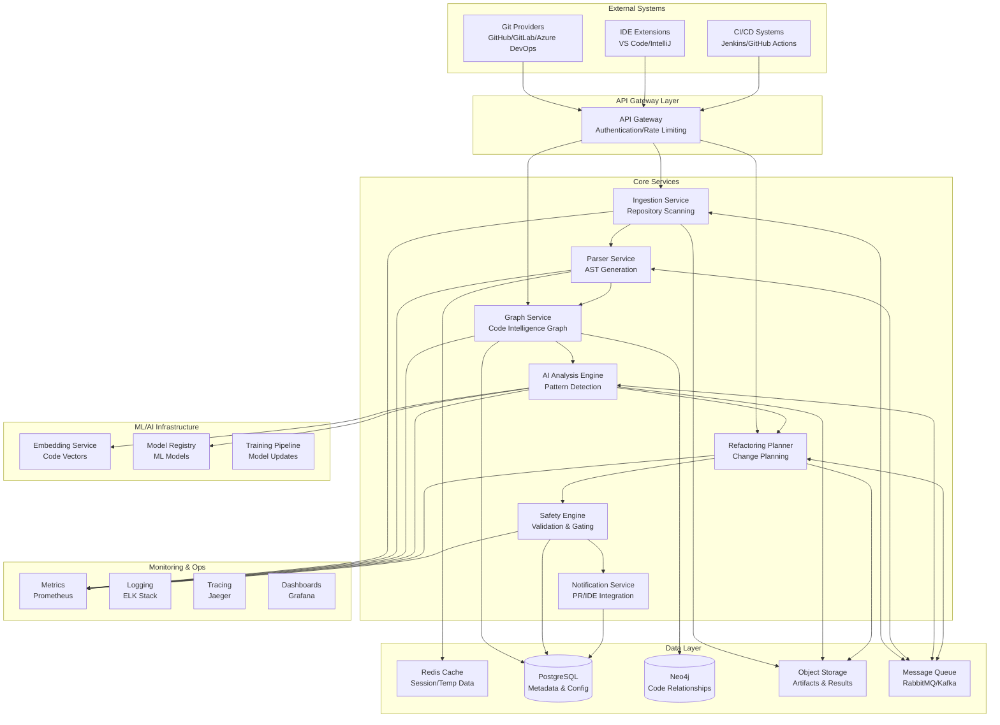

# Codebase Intelligence Engine - System Architecture

## Architecture Overview

The Codebase Intelligence Engine is a distributed system designed to analyze large codebases, build semantic understanding, and propose safe refactoring opportunities. The system follows a microservices architecture with event-driven communication and horizontal scalability.

## Core Design Principles

1. **Modularity**: Each component is independently deployable and scalable
2. **Safety First**: All changes go through validation gates before proposal
3. **Incremental Processing**: Support for incremental analysis to handle large codebases
4. **Language Agnostic**: Polyglot support through pluggable parsers
5. **Human-in-the-Loop**: AI suggestions are always reviewed by humans
6. **Observability**: Comprehensive monitoring and tracing throughout

## High-Level Architecture

For a detailed visual representation of the system architecture, see: [`high_level_diagram.md`](high_level_diagram.md)



## Data Flow

For a detailed visual representation of the data flow, see: [`data_flow_diagram.md`](data_flow_diagram.md) Architecture

### 1. Ingestion & Parsing Flow
```
Repository → Clone/Diff → File Discovery → Language Detection → Parser Selection → AST Generation → Symbol Extraction → Graph Storage
```

### 2. Analysis Flow
```
Code Intelligence Graph → Feature Extraction → ML Model Inference → Pattern Detection → Risk Scoring → Finding Generation
```

### 3. Refactoring Flow
```
Findings → Impact Analysis → Dependency Analysis → Change Planning → Safety Validation → PR Generation → Monitoring
```

## Component Interaction Patterns

### Synchronous Interactions
- API Gateway ↔ Core Services (REST/GraphQL)
- Services ↔ Databases (Direct connections)
- Safety Engine ↔ External CI systems

### Asynchronous Interactions
- Ingestion → Parser (Message Queue)
- Parser → AI Engine (Message Queue)
- AI Engine → Planner (Message Queue)
- Event notifications (Pub/Sub)

### Event-Driven Patterns
- Repository change events
- Analysis completion events
- Safety gate events
- Deployment events

## Scalability Architecture

### Horizontal Scaling
- **Stateless Services**: All core services are stateless and can be horizontally scaled
- **Database Sharding**: Graph database sharded by repository/organization
- **Queue Partitioning**: Message queues partitioned by repository or project
- **Cache Distribution**: Redis cluster for distributed caching

### Vertical Scaling
- **GPU Acceleration**: ML inference on GPU-enabled nodes
- **Memory Optimization**: Large memory instances for graph processing
- **Storage Tiering**: Hot/warm/cold storage for artifacts

### Auto-scaling Triggers
- Queue depth monitoring
- CPU/Memory utilization
- Response time SLAs
- Cost optimization

## Security Architecture

### Authentication & Authorization
- **OAuth 2.0/OpenID Connect** for user authentication
- **Service-to-Service** authentication via mutual TLS
- **API Keys** for external integrations
- **RBAC** (Role-Based Access Control) for fine-grained permissions

### Data Protection
- **Encryption at Rest**: All data encrypted with AES-256
- **Encryption in Transit**: TLS 1.3 for all communications
- **PII Redaction**: Automatic removal of sensitive data
- **Secrets Management**: HashiCorp Vault integration

### Network Security
- **VPC Isolation**: All components in private subnets
- **WAF Protection**: Web Application Firewall at API Gateway
- **DDoS Protection**: CloudFlare/AWS Shield integration
- **Network Segmentation**: Micro-segmentation between services

## Deployment Architecture

### Container Strategy
- **Docker Containers**: All services containerized
- **Kubernetes Orchestration**: K8s for container orchestration
- **Helm Charts**: Templated deployments
- **Multi-environment**: Dev/Staging/Prod environments

### Infrastructure as Code
- **Terraform**: Infrastructure provisioning
- **Ansible**: Configuration management
- **GitOps**: ArgoCD for deployment automation

### High Availability
- **Multi-AZ Deployment**: Services across multiple availability zones
- **Load Balancing**: Application and network load balancers
- **Circuit Breakers**: Fault tolerance patterns
- **Backup & Recovery**: Automated backup strategies

## Performance Characteristics

### Latency Requirements
- **API Response Time**: < 200ms for read operations
- **Analysis Time**: < 10 minutes for medium repositories
- **PR Generation**: < 5 minutes for refactoring proposals

### Throughput Requirements
- **Concurrent Repositories**: 1000+ repositories under analysis
- **Daily Scans**: 10,000+ incremental scans
- **API Requests**: 100,000+ requests per day

### Storage Requirements
- **Repository Data**: 100TB+ of source code and artifacts
- **Graph Data**: 10TB+ of relationship data
- **ML Models**: 1TB+ of trained models and embeddings

## Technology Stack

### Core Services
- **Runtime**: Node.js/Python/Go (polyglot microservices)
- **Frameworks**: Express.js, FastAPI, Gin
- **Communication**: gRPC, REST, GraphQL

### Data Storage
- **Relational**: PostgreSQL with read replicas
- **Graph**: Neo4j Community/Enterprise
- **Cache**: Redis Cluster
- **Object Storage**: AWS S3/Azure Blob/GCS
- **Search**: Elasticsearch

### ML/AI Stack
- **Training**: PyTorch, TensorFlow
- **Inference**: TensorRT, ONNX Runtime
- **Vector Search**: Pinecone, Weaviate
- **Feature Store**: Feast

### Infrastructure
- **Container Platform**: Kubernetes
- **Service Mesh**: Istio
- **Message Queue**: Apache Kafka
- **Monitoring**: Prometheus, Grafana, Jaeger

## Quality Attributes

### Reliability
- **Availability**: 99.9% uptime SLA
- **Fault Tolerance**: Graceful degradation
- **Data Integrity**: ACID transactions where needed

### Performance
- **Scalability**: Horizontal scaling to 10x current load
- **Efficiency**: Resource optimization and cost control
- **Responsiveness**: Real-time updates where possible

### Security
- **Confidentiality**: Data encryption and access controls
- **Integrity**: Tamper-evident audit logs
- **Availability**: DDoS protection and rate limiting

### Maintainability
- **Modularity**: Loosely coupled components
- **Testability**: Comprehensive test coverage
- **Observability**: Rich monitoring and debugging

## Future Extensibility

### Plugin Architecture
- **Language Parsers**: Pluggable parser framework
- **Analysis Rules**: Custom rule engine
- **Integration Points**: Webhook-based extensions

### API Evolution
- **Versioned APIs**: Backward compatibility strategy
- **GraphQL Schema**: Flexible query interface
- **Event Streaming**: Real-time data access

### AI/ML Enhancement
- **Model Marketplace**: Community-contributed models
- **Transfer Learning**: Adapt models to specific codebases
- **Federated Learning**: Privacy-preserving model training