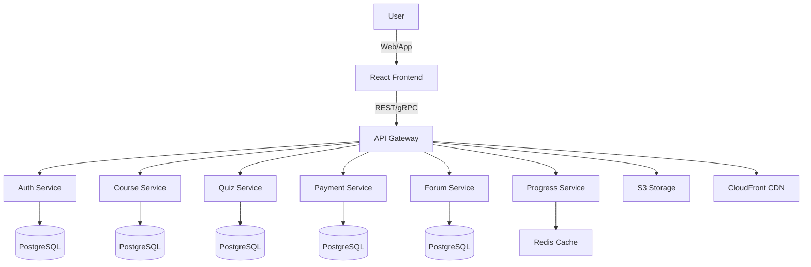

# Architecture Diagram

Below is a high-level architecture diagram for the Online Education Platform.

```mermaid
graph TD
  User[User] -->|Web/App| Frontend[React Frontend]
  Frontend -->|REST/gRPC| API[API Gateway]
  API --> Auth[Auth Service]
  API --> Course[Course Service]
  API --> Quiz[Quiz Service]
  API --> Payment[Payment Service]
  API --> Forum[Forum Service]
  API --> Progress[Progress Service]
  Auth --> DB1[(PostgreSQL)]
  Course --> DB2[(PostgreSQL)]
  Quiz --> DB3[(PostgreSQL)]
  Payment --> DB4[(PostgreSQL)]
  Forum --> DB5[(PostgreSQL)]
  Progress --> Redis[Redis Cache]
  API --> S3[S3 Storage]
  API --> CDN[CloudFront CDN]
```

---

For a PNG version, export this diagram using the Mermaid Live Editor or similar tool.